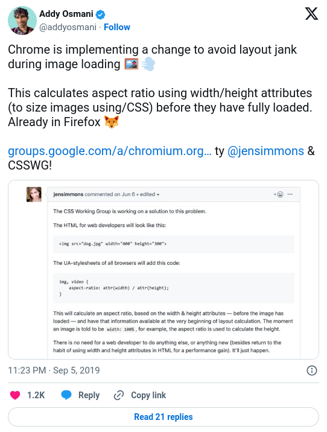

# 0x00. Advanced HTML

> HTML | Front-end

This project focuses on **mastering advanced HTML techniques** and **best practices** for creating **well-structured, semantic, and accessible web pages** for better search engine optimization (SEO). It covers the fundamentals of **modern HTML5,** emphasizing the importance of **proper document structure, semantic markup,** and the effective use of **multimedia elements**. The project aims to improve your understanding of HTML's role in creating the foundation for **robust and user-friendly web applications.**

## Concepts

For this project, we expect you to look at these concepts:

<details>
<summary><b>HTML - elements of a web page</summary></b><br>

Create the foundation of any HTML page.

HTML is about content. CSS is about the look and feel.

<br>

### Doctype

The `<doctype>` is necessary at the top of every HTML page to force the browser to render the page according to relevant specifications.

```
<!-- Doctype HTML5 -->
<!DOCTYPE html>
<!-- Lowercase is also valid -->
<!doctype html>
```

### Resources

* [Doctype - MDN Web Docs Glossary: Definitions of Web-related terms | MDN](https://developer.mozilla.org/en-US/docs/Glossary/Doctype)
* [HEAD - A free guide to head elements](https://htmlhead.dev/)

<br>

### `HTML` tag

The `<html>` HTML tag tells the browser that the document is an HTML webpage. It is used as a container for all the HTML elements.

Warning!

The doctype is the only element living outside the html tag.

```<html lang="fr" dir="ltr">```

### Language and reading direction
* [Building RTL-Aware Web Apps & Websites: Part 1 - Mozilla Hacks - the Web developer blog](https://hacks.mozilla.org/2015/09/building-rtl-aware-web-apps-and-websites-part-1/?ref=frontendchecklist)

<br>

### `head` tag
The head tag element contains all the metadatas related to your page. All the elements put in the head are not visible in the window of the browser.

A lot of metadatas exist, some specific to some CMS.

#### Usage
You can find inside the `head`:

* title of the webpage
* asynchronous script calls
* metadata
* CSS code embed (critical CSS)
* JavaScript code embed

#### Resources

* [HEAD - A free guide to head elements](https://htmlhead.dev/)

<br>

### Meta charset

The `meta` charset declares the page’s character encoding.

```
...
<head>
    <!-- Set character encoding for the document -->
    <meta charset="value">
</head>
...
```

#### Resources

* [meta: The Document-level Metadata element - HTML: Hypertext Markup Language | MDN](https://developer.mozilla.org/en-US/docs/Web/HTML/Element/meta#attr-charset)
* [Declaring character encodings in HTML](https://www.w3.org/International/questions/qa-html-encoding-declarations)
* [Meta Charset](https://bitsofco.de/meta-charset/)

<br>

### Viewport

The meta `viewport` gives information about the initial size of the viewport.

Tip: The viewport is used by mobile devices only.

Accessibility tip: Never use `maximum-scale=1.0`. [It prevents the user from zooming in on the website](https://www.a11yproject.com/posts/never-use-maximum-scale/). It causes an accessibility issue.

```
...
<head>
    ...
    <!-- Viewport for responsive web design -->
    <meta name="viewport" content="key=value, key=value">
</head>
...
```

#### Resources

* [Responsive Design With Viewport Control](https://bitsofco.de/responsive-design-viewport/)

<br>

### Title

The `title` meta tag defines the title of the web page.

Tip: The title is only visible on the tab/window of your browser.

Warning! The title should always have less than 56 characters.

```
...
  <head>
    ...
    <!-- Document Title -->
    <title>Page title</title>
  </head>
...
```

#### Resources

* [The ideal width of the SEO title • Yoast](https://yoast.com/page-titles-seo/)

<br>

### Meta description

```
<head>
    ...
    <!-- Meta Description -->
    <meta name="description" content="Description of the page less than 150 characters">
  </head>
```

#### Resources

* [The ideal length of a meta description • Yoast](https://yoast.com/meta-descriptions/)

<br>

### Favicons

```
<head>
    ...
    <!-- Standard favicon -->
    <link rel="icon" type="image/x-icon" href="https://example.com/favicon.ico">
    <!-- Recommended favicon format -->
    <link rel="icon" type="image/png" href="https://example.com/favicon.png">
    ...
  </head>
```

#### Resources
* [Favicon & App Icon Generator](https://www.favicon-generator.org/)
* [Favicon Generator for all platforms: iOS, Android, PC/Mac…](https://realfavicongenerator.net/)
* [Obsessive cheat sheet to favicon sizes/types.)](https://github.com/audreyfeldroy/favicon-cheat-sheet)
* [Favicons, Touch Icons, Tile Icons, etc. Which Do You Need? | CSS-Tricks](https://css-tricks.com/favicon-quiz/)
* [PNG favicons - caniuse](https://caniuse.com/link-icon-png)

<br>

### Tag attributes

Attributes provide additional information or instruction for an HTML element. It is **always** included inside the opening tag.

### Data-* attribute

It is possible to declare any attribute using the `data-` prefix

```<tag data-extra-attr="value">some content</tag>```

### Resources

* [HTML attribute reference - HTML: Hypertext Markup Language | MDN](https://developer.mozilla.org/en-US/docs/Web/HTML/Attributes)

<br>

### `header` tag

The `<header>` HTML tag element is used to identify the top of a webpage, article, section, or other segment of a page. The header is normally always the same across all pages of your website.


### Usage

* logo of the website
* navigation
* search form

```
...
<body>
    <header>This is my header<header/>
</body>
```

Warning! The `main` element should never be a descendant of an `article`, `aside`, `header`, `footer`, or `nav` element.

Don’t confuse `header` with the `head` element of the page.

### Resources

* [header - HTML: Hypertext Markup Language | MDN](https://developer.mozilla.org/en-US/docs/Web/HTML/Element/header)

<br>

### `main` tag

The `<main>` HTML tag is a structural element located generally between the `<header>` and the `<footer>` and contains the content of your web page.


```
...
<body>
    <header>This is my header</header>
    <main>
        This is where I put my content
    </main>
</body>
```

<br>

### `footer` tag

The `<footer>` HTML tag is a structural element used to identify the footer of a page, article, or section.


### Usage

* copyright information
* authorship information
* navigation elements
* social icons or links

```
...
<body>
    <header>This is my header<header/>
    <main>
        This is where I put my content
    </main>
    <footer>This is the footer of my page</footer>
</body>
```

### Resources

* [footer - HTML: Hypertext Markup Language | MDN](https://developer.mozilla.org/en-US/docs/Web/HTML/Element/footer)

<br>

### `aside` tag

The `<aside>` HTML tag contains additional information related to the `main` content.


### Usage

* monthly archives
* list of categories

```
...
<body>
    ...
    <main>
        <section>
            <article>This is my article 1</article>
            <article>This is my article 2</article>
            <article>This is my article 3</article>
        </section>
        <aside>
        </aside>
    </main>
    ...
</body>
```

<br>

### `section` tag

The `<section>` tag element allows the grouping of related elements. You can usually find a `<header>` and `<footer>` attached to a section.


### Usage

```
...
<body>
    ...
    <main>
        <section>This is my section 1</section>
        <section>This is my section 2</section>
        <section>This is my section 3</section>
    </main>
    ...
</body>
```

### Resources

* [section: The Generic Section element - HTML: Hypertext Markup Language | MDN](https://developer.mozilla.org/en-US/docs/Web/HTML/Element/section)

<br>

### `article` tag

An `<article>` HTML tag represent a self-contained piece of content which could theoretically be distributed to other websites and platforms as a stand-alone unit.


### Usage

* blog posts
* news articles
* product cards
* forum posts

```
...
<body>
    ...
    <main>
        <section>
            <article>This is article 1</article>
            <article>This is article 2</article>
        </section>
    </main>
    ...
</body>
```

### Resources

* [article: The Article Contents element - HTML: Hypertext Markup Language | MDN}(https://developer.mozilla.org/en-US/docs/Web/HTML/Element/article)

<br>

### `nav` tag
The `<nav>` HTML tag is a structural element with navigation links.


```
...
<body>
    <header> I'm inside the header
        <nav>
          <!-- This is an example of links -->
          <a href="/">Home</a>
          <a href="/about">About</a>
          <a href="/contact">Contact</a>
          <!-- / -->
        </nav>
    <header/>
    ...
</body>
```

### Resources

* [nav: The Navigation Section element - HTML: Hypertext Markup Language | MDN](https://developer.mozilla.org/en-US/docs/Web/HTML/Element/nav)

<br>

### Headings

Headings are used to define a section heading.

| Type  | Self-closing |
|-------|--------------|
| Block | No           |

Warning! Browsers apply different sizes for each heading in their default CSS rules. Keep in mind that HTML is about content and not the styling. Never use an `h4` after an `h2`. For example, always keep a descendant order (h1 > h2 > h3…).

Accessibility tip: Headings are used by voice browser to help navigate through the webpage.

```
<h1>This is my title level 1</h1>
<h2>This is my title level 2</h2>
...
```

Tip: Never put the logo or name of your website inside an `<h1>`. The text inside this tag has to reflect the content of your page. On a homepage, based on the design, you can eventually hide visually your `<h1>` but it still has to exist in your code.

### Resources

* [h1–h6: The HTML Section Heading elements - HTML: Hypertext Markup Language | MDN](https://developer.mozilla.org/en-US/docs/Web/HTML/Element/Heading_Elements)

<br>

### `p` tag
A `<p>` HTML tag defines a paragraph of text.

| Type  | Self-closing |
|-------|--------------|
| Block | No           |

Warning! If you need a container to wrap multiple elements, use `div` instead of `p`. Only use the paragraph tag if your content could be considered a paragraph of text.

```
<p>Lorem ipsum dolor sit amet, consectetur adipiscing elit.</p>
```

### Resources

* [p: The Paragraph element - HTML: Hypertext Markup Language | MDN](https://developer.mozilla.org/en-US/docs/Web/HTML/Element/p)

`div` and `span` don’t possess any semantic meaning. They are mostly used to define a `block` (div) of content, or an `inline` (span) content.

<br>

### span

A `span` is a generic inline of content used usually for text that are not inside a **paragraph**. `span` should be used as little as possible.

```
<span>This is my first span</span>
```

| Type   | Self-closing |
|--------|--------------|
| Inline | No           |

<br>

### div
A `div` (stands for “document division”) is a generic block of content used to structure elements in your layout.

```
<div>This is my first div</div>
```

| Type  | Self-closing |
|-------|--------------|
| Block | No           |

<br>

### Comments

Comments allow you to add some information visible for the developer but not for the normal user. Comments are not visible on your page.

```
<!-- This is a comment about how much I love eggs! -->
```

### Resources

* [About conditional comments (Internet Explorer) | Microsoft Docs](https://learn.microsoft.com/en-us/previous-versions/windows/internet-explorer/ie-developer/compatibility/ms537512(v=vs.85)?redirectedfrom=MSDN)

<br>

### `a` tag

Links are inline elements which allow you to navigate from one page / document to another.

| Type   | Self-closing |
|--------|--------------|
| Inline | No           |

There are **3** types of targets:

* anchor targets, to navigate within the same page
* relative URLs, usually to navigate within the same website
* absolute URLs, usually to navigate to another website

```
<a href="#services">Link</a> <-- anchor target -->
<a href="/blog">Link</a> <-- relative url -->
<a href="https://www.example.com">Link</a> <-- absolute url -->
```

If you use `target=_blank` don’t forget to add `rel=noopner` for security purposes.

### Resources

* [a: The Anchor element - HTML: Hypertext Markup Language | MDN](https://developer.mozilla.org/en-US/docs/Web/HTML/Element/a)
* [About rel=noopener](https://mathiasbynens.github.io/rel-noopener/)
* [Mailto Links | CSS-Tricks](https://css-tricks.com/snippets/html/mailto-links/)

### Future changes in the link attribution (rel)

```
<div>
  <div>
    <a href="#" rel="noopener" target="_blank">Link open in a new tab</a>
  </div>
  <div>
    <a href="#" rel="sponsored">Paid and sponsored links</a>
  </div>
  <div>
    <a href="#" rel="ugc">User-generated content</a>
  </div>
  <div>
    <a href="#" rel="nofollow">Catch-all for all non-trusted links</a>
  </div>
</div>
```


#### Resources

* [Official Google Webmaster Central Blog: Evolving “nofollow” – new ways to identify the nature of links](https://developers.google.com/search/blog/2019/09/evolving-nofollow-new-ways-to-identify)
* [How Google’s Nofollow, Sponsored, & UGC Links Impact SEO - Moz](https://developers.google.com/search/blog/2019/09/evolving-nofollow-new-ways-to-identify)

<br>

### Lists

Lists are used for listing ingredients in a recipe, a series of social icons, etc..

| Type  | Self-closing |
|-------|--------------|
| Block | No           |

#### Resources

* [ul: The Unordered List element - HTML: Hypertext Markup Language | MDN](https://developer.mozilla.org/en-US/docs/Web/HTML/Element/ul)
* [li - HTML: Hypertext Markup Language | MDN](https://developer.mozilla.org/en-US/docs/Web/HTML/Element/li)
* [ol: The Ordered List element - HTML: Hypertext Markup Language | MDN](https://developer.mozilla.org/en-US/docs/Web/HTML/Element/ol)
* [dl: The Description List element - HTML: Hypertext Markup Language | MDN](https://developer.mozilla.org/en-US/docs/Web/HTML/Element/dl)

<br>

### Ordered list (ol)

An ordered list is rendered as a numbered list.

```
<!-- an ordered list number -->
<ol>
  <li>List item 1</li>
  <li>List item 2</li>
  <li>List item 3</li>
</ol>
<!-- an ordered list width Roman numerals -->
<ol type="i">
  <li>List item 1</li>
  <li>List item 2</li>
  <li>List item 3</li>
</ol>
```

### Unordered list (ul)

An unordered list is rendered as an unordered list of items.

```
<!-- flat list -->
<ul>
  <li>First bullet point</li>
  <li>Second bullet point</li>
  <li>Third bullet point</li>
</ul>
<!-- list with a nested list -->
<ul>
  <li>First bullet point</li>
  <li>Second bullet point
    <!-- Nested unorderd lit -->
    <ul>
      <li>First bullet point</li>
      <li>Second bullet point</li>
      <li>Third bullet point</li>
    </ul>
  </li> <!-- Closing li tag -->
  <li>Third bullet point</li>
</ul>
```

### Definition list

A definition list is used to list terms and corresponding definitions.

```
<dl>
  <dt>Term</dt>
  <dd>Definition of the term</dd>
  <dt>Another term</dt>
  <dd>Another definition of the term</dd>
</dl>
```

<br>

### Horizontal rules

An `hr` is a semantic break that separates different blocks of text.

| Self-closing |
|--------------|
| Yes          |

```
<p>Lorem ipsum dolor sit amet, consectetur adipiscing elit.</p>
<hr>
<h2>Section</h2>
<p>Lorem ipsum dolor sit amet, consectetur adipiscing elit.</p>
```

### Resources

* [hr: The Thematic Break (Horizontal Rule) element - HTML: Hypertext Markup Language | MDN](https://developer.mozilla.org/en-US/docs/Web/HTML/Element/hr)

<br>

### Line Breaks

Line breaks are used to break the text to multiple lines.

| Self-closing |
|--------------|
| Yes          |

```
<p>Lorem ipsum dolor sit amet, consectetur adipiscing elit. <br>
Donec viverra<br>
nec<br>
nulla vitae mollis</p>
```

Never use line breaks for presentation purpose, to create space between elements in your design. Spacing and layout should only be handled by CSS.

### Resources

* [br: The Line Break element - HTML: Hypertext Markup Language | MDN](https://developer.mozilla.org/en-US/docs/Web/HTML/Element/br)

<br>

### Inline quotation

Inline quotes is used for inline text that doesn’t require paragraph breaks.

```
<p>
  According to Mozilla's website,
  <q cite="https://www.mozilla.org/en-US/about/history/details/">Firefox 1.0 was released in 2004 and became a big success.</q>
</p>
```

### Resources

* [q: The Inline Quotation element - HTML: Hypertext Markup Language | MDN](https://developer.mozilla.org/en-US/docs/Web/HTML/Element/q)

<br>

### Blockquote
A multiline quote is called a blockquote.

| Type  | Self-closing |
|-------|--------------|
| Block | No           |

```
<!-- DO -->
<blockquote cite="https://tools.ietf.org/html/rfc1149">
  <p>Avian carriers can provide high delay, low
  throughput, and low altitude service.  The
  connection topology is limited to a single
  point-to-point path for each carrier, used with
  standard carriers, but many carriers can be used
  without significant interference with each other,
  outside of early spring.  This is because of the 3D
  ether space available to the carriers, in contrast
  to the 1D ether used by IEEE802.3.  The carriers
  have an intrinsic collision avoidance system, which
  increases availability.</p>
</blockquote>
<!-- DON'T -->
<blockquote>For writing maintainable and scalable HTML documents.</blockquote>
<!-- Blockquote with a cite reference -->
<blockquote>
  <p>People think focus means saying yes to the thing you’ve got to focus on. But that’s not what it means at all. It means saying no to the hundred other good ideas that there are. You have to pick carefully. I’m actually as proud of the things we haven’t done as the things I have done. Innovation is saying no to 1,000 things.
    <cite>Steve Jobs – Apple Worldwide Developers’ Conference, 1997</cite>
  </p>
</blockquote>
```

### Resources

* [blockquote: The Block Quotation element - HTML: Hypertext Markup Language | MDN](https://developer.mozilla.org/en-US/docs/Web/HTML/Element/blockquote)

<br>

### Text/Typography

A long list of HTML tags are used to give semantic meaning to specific text. Each tag is essential to help users and browsers understand the specificity of a certain portion of text. It’s crucial to understand which can be used in which situation.

* `<em>` to indicate stress emphasis.
* `<i>` to indicate text set off from the normal prose (foreign word, technical term…).
* `<strong>` to indicate stronger importance.
* `<b>` to draw attention to specific content (keywords in a summary, product names in a review…).
* `<small>` to represent side-comments or small text (copyright, legal text…).
* `<del>` to represent a text that has been deleted.
* `<ins>` to represent a text that has been inserted.
* `<s>` to render text with a strikethough or a line through it.
* `<wbr>` to specify where the text could have a line-break.
* `<mark>` to indicate relevance, representing text marked or highlighted for reference.
* `<cite>` to mark the name of a work, such as a book, play, or song.
* `<dfn>` to mark the defining instance of a term.
* `<abbr>` to represents an abbreviation or acronyme.
* `<code>` to indicate at short fragment of computer code.
* `<time>` to indicate a specific period in time.
* `<address>` to indicate contact information (person, people or organization).
Warning!

Some tags like `<strong>` and `<b>` may look the same visually in your browser. Please remember that HTML is about content, semantics, and not the visual aspect.

```
<ul>
  <li>
    I <em>really</em> like driving in San Francisco.
  </li>
  <li>
    The term <i>voilier</i> is a french word which mean "sailing ship".
  </li>
  <li>
    <strong>Warning!</strong> This is not a drill!
  </li>
  <li>
    <b>This text is bold.</b>
  </li>
  <li>
    <p>Atomic Habits: An Easy & Proven Way to Build Good Habits & Break Bad Ones <small>(Penguin Group USA) <small>Kindle Edition</small>
by</small> James Clear <small>  (Author)</small></p>
  </li>
  <li>
    <p>I'm silently correcting <del>you're</del> <ins>your</ins> grammar.</p>
  </li>
  <li>
    I received <s>$500</s> $1000 for that job!
  </li>
  <li>
    I want to understand <wbr>what</wbr><wbr>is</wbr><wbr>going</wbr><wbr>on</wbr>!
  </li>
  <li>
    <mark>This whole text should be highlighted in yellow.</mark>
  </li>
  <li>
    <blockquote>
    Any inaccuracies in this index may be explained by the fact that it has been sorted with the help of a computer.<br>
    — from <cite>The Art of Computer Programming</cite> by Donald Knuth
    </blockquote>
  </li>
  <li>
    <p>The <strong>HTML Definition element</strong>
    (<strong><dfn>&lt;dfn&gt;</dfn></strong>) is
    used to indicate the term being defined within the context<br/> of a
    definition phrase or sentence.</p>
  </li>
  <li>
    <p>You are the <abbr title="Cascading Style Sheets">CSS</abbr> of my <abbr title="HyperText Markup Language">HTML</abbr>.</p>
  </li>
  <li>
    <code></code>
  </li>
  <li>
    <pre>
      <code>
        body {
          color: red;
        }
      </code>
    </pre>
  </li>
  <li>
    <time datetime="2019-09-19">Sept 19, 2019</time>
  </li>
  <li>
    <address>
      <a href="mailto:someone@example.com">someone@example.com</a>
    </address>
  </li>
</ul>
```

### Resources

* [em: The Emphasis element - HTML: Hypertext Markup Language | MDN](https://developer.mozilla.org/en-US/docs/Web/HTML/Element/em)
* [i - HTML: Hypertext Markup Language | MDN](https://developer.mozilla.org/en-US/docs/Web/HTML/Element/i)
* [strong: The Strong Importance element - HTML: Hypertext Markup * Language | MDN](https://developer.mozilla.org/en-US/docs/Web/HTML/Element/strong)
* [b: The Bring Attention To element - HTML: Hypertext Markup Language | MDN](https://developer.mozilla.org/en-US/docs/Web/HTML/Element/b)
* [small: the side comment element - HTML: Hypertext Markup Language | MDN](https://developer.mozilla.org/en-US/docs/Web/HTML/Element/small)
* [del: The Deleted Text element - HTML: Hypertext Markup Language | MDN](https://developer.mozilla.org/en-US/docs/Web/HTML/Element/del)
* [ins - HTML: Hypertext Markup Language | MDN](https://developer.mozilla.org/en-US/docs/Web/HTML/Element/ins)
* [s - HTML: Hypertext Markup Language | MDN](https://developer.mozilla.org/en-US/docs/Web/HTML/Element/s)
* [wbr - HTML: Hypertext Markup Language | MDN](https://developer.mozilla.org/en-US/docs/Web/HTML/Element/wbr)
* [mark: The Mark Text element - HTML: Hypertext Markup Language | MDN](https://developer.mozilla.org/en-US/docs/Web/HTML/Element/mark)
* [cite: The Citation element - HTML: Hypertext Markup Language | MDN](https://developer.mozilla.org/en-US/docs/Web/HTML/Element/cite)
* [dfn: The Definition element - HTML: Hypertext Markup Language | MDN](https://developer.mozilla.org/en-US/docs/Web/HTML/Element/dfn)
* [abbr: The Abbreviation element - HTML: Hypertext Markup Language | MDN](https://developer.mozilla.org/en-US/docs/Web/HTML/Element/abbr)
* [code: The Inline Code element - HTML: Hypertext Markup Language | MDN](https://developer.mozilla.org/en-US/docs/Web/HTML/Element/code)
* [time - HTML: Hypertext Markup Language | MDN](https://developer.mozilla.org/en-US/docs/Web/HTML/Element/time)
* [address: The Contact Address element - HTML: Hypertext Markup Language | MDN](https://developer.mozilla.org/en-US/docs/Web/HTML/Element/address)

<br>

### Tables

A table element is used to wrap tabular content. It uses rows and columns to organize the data.

Accessibility tip: Always use `<caption>` to help people understand the content of your table.

### Anatomy of a table

* `caption:` the title of a table.
* `thead:` groups multiple rows that represents the head of the columns
* `tbody:` groups multiple rows that represents the body of the table
* `tfoot:` groups multiple rows that represents the footer of the table
* `th:` a cell as header of a group of table cells
* `tr:` a row of cells
* `td:` a cell of a table
* `col attribute:` defines a column within a table.
* `colgroup attribute:` defines a group of columns within a table.

```
<!-- Table with thead, tfoot, and tbody -->
<table>
  <caption>The table</caption>
  <thead>
    <tr>
      <th scope="col">Header content 1</th>
      <th scope="col">Header content 2</th>
      <th scope="col">Header content 3</th>
    </tr>
  </thead>
  <tbody>
    <tr>
      <th scope="row">Body content 1</th>
      <td>Body content 2</td>
      <td>Body content 3</td>
    </tr>
  </tbody>
  <tfoot>
    <tr>
      <th scope="row">Footer content 1</th>
      <td>Footer content 2</td>
      <td>Footer content 3</td>
    </tr>
  </tfoot>
</table>
<!-- Table without scope -->
<table>
  <caption>The table</caption>
  <thead>
    <tr>
      <th>Header content 1</th>
      <th>Header content 2</th>
    </tr>
  </thead>
  <tbody>
    <tr>
      <td>Body content 1</td>
      <td>Body content 2</td>
    </tr>
  </tbody>
  <tfoot>
    <tr>
      <td>Footer content 1</td>
      <td>Footer content 2</td>
    </tr>
  </tfoot>
</table>
```

### Resources

* [table: The Table element - HTML: Hypertext Markup Language | MDN](https://developer.mozilla.org/en-US/docs/Web/HTML/Element/table)
* [thead: The Table Head element - HTML: Hypertext Markup Language | MDN](https://developer.mozilla.org/en-US/docs/Web/HTML/Element/thead)
* [tbody: The Table Body element - HTML: Hypertext Markup Language | MDN](https://developer.mozilla.org/en-US/docs/Web/HTML/Element/tbody)
* [tfoot: The Table Foot element - HTML: Hypertext Markup Language | MDN](https://developer.mozilla.org/en-US/docs/Web/HTML/Element/tfoot)
* [th - HTML: Hypertext Markup Language | MDN](https://developer.mozilla.org/en-US/docs/Web/HTML/Element/th)
* [tr: The Table Row element - HTML: Hypertext Markup Language | MDN](https://developer.mozilla.org/en-US/docs/Web/HTML/Element/tr)
* [td: The Table Data Cell element - HTML: Hypertext Markup Language | MDN](https://developer.mozilla.org/en-US/docs/Web/HTML/Element/td)

<br>

### `details` tag

The `<details>` HTML element gives a native way to create something similar to an accordion.

```
<details>
  <summary>Details</summary>
  Something small enough to escape casual notice.
</details>
```

### Resources

* [details: The Details disclosure element - HTML: Hypertext Markup Language | MDN](https://developer.mozilla.org/en-US/docs/Web/HTML/Element/details)
* [summary: The Disclosure Summary element - HTML: Hypertext Markup Language | MDN](https://developer.mozilla.org/en-US/docs/Web/HTML/Element/summary)
* [Quick Reminder that Details/Summary is the Easiest Way Ever to Make an Accordion | CSS-Tricks](https://css-tricks.com/quick-reminder-that-details-summary-is-the-easiest-way-ever-to-make-an-accordion/)

<br>

### Image

The image element (``) allows us to use images on a website.

| Type   | Self-closing |
|--------|--------------|
| Inline | Yes          |

Accessibility tip: You should always have an `alt` on your image. With text or without, depending if your image is decorative or not. The `alt` should describe what is inside your image. Never use the title of your blog post or some similar text.

Tip: Always specify the width and height of the image. It will avoid layout jank during image loading. Chrome and other browsers are working (Firefox already has that functionality) on improving the experience.

[](https://x.com/addyosmani/status/1169813271009886208)

```
<!-- using a url relative to the HTML page -->

<!-- using an absolute url from another website -->

```

### Resources

* [img: The Image Embed element - HTML: Hypertext Markup Language | MDN]()
* [Essential Image]()

### Placeholder generators

* [https://placebear.com/](https://placebear.com/)
* [https://picsum.photos/](https://picsum.photos/)
* [http://placehold.it/](http://placehold.it/)
* [https://www.placecage.com/](https://www.placecage.com/)

<br>

### Image formats

`JPEG`, `PNG`, `GIF`, `SVG` and `WebP` are the most common format of image used on the Web. Each of them has his own particularity and usage. It’s essential to understand these and always ensure that they are optimized to be shown on a webpage.

* [Support image format](https://developer.mozilla.org/en-US/docs/Web/HTML/Element/img#Supported_image_formats)
* [JPEG, GIF, PNG OR SVG - Which should You use?](https://dev.to/sarah_chima/jpeg-gif-png-or-svg---which-should-i-use-1o8o)
* [SVG vs PNG vs JPG: Image Format Pros & Cons | Design Shack](https://designshack.net/articles/graphics/svg-vs-png-vs-jpg/)
* [SVGOMG - SVGO’s Missing GUI](https://jakearchibald.github.io/svgomg/)

Warning! It’s not unusual to find websites that load images with more than 1 MB. It’s obviously not recommended. Nowadays, people browse the web more using a wireless connection and then could be limited in their data package. It’s important to always keep that in mind.

<br>

### Picture

The `<picture>` HTML tag is used as a wrapper to combine different sources which provide different versions of an image. (It can also be use to offer different versions for different devices/display.)

```
<picture>
  <source srcset="/img/logo.webp" type="image/webp">
  <source srcset="/img/logo.jp2" type="image/jp2">
  
</picture>
```

### Resources

* [picture: The Picture element - HTML: Hypertext Markup Language | MDN](https://developer.mozilla.org/en-US/docs/Web/HTML/Element/picture)
* [Bye raster, hello vector: 3 ways to use SVG easier · Devbridge](https://www.cognizant.com/us/en/services/software-engineering-services)

<br>

### `video` tag

The `<video>` HTML Tag gives the capability to add a native video player in your HTML.

Accessibility tip: It’s essential to provide an alternative text in case the `<video>` tag is not supported or the video doesn’t exist anymore.

Avoid using the attribute `autoplay` and let the user decide if they want to play the video. Of course, for videos used in the background, `autoplay` and `loop` will probably be essential.

```
<video width="640" height="480" src="https://archive.org/download/Popeye_forPresident/Popeye_forPresident_512kb.mp4" controls>
  Sorry, your browser doesn't support HTML5 <code>video</code>, but you can
  download this video from the <a href="https://archive.org/details/Popeye_forPresident" target="_blank">Internet Archive</a>.
</video>
```

### Resources

* [video: The Video Embed element - HTML: Hypertext Markup Language | MDN](https://developer.mozilla.org/en-US/docs/Web/HTML/Element/video)
* [Media formats for HTML audio and video](https://developer.mozilla.org/en-US/docs/Web/Media/Formats)
* [Can I use… video](https://caniuse.com/#search=video)

<br>

### `audio` tag

The `audio` HTML Tag gives the capability to embed sound content in your HTML.

```
<!-- single audio file -->
<audio src="/music/audiofile.mp3" controls>
<!-- multiple audio files -->
<audio controls>
  <source src="audiofile.mp3" type="audio/mpeg">
  <source src="audiofile.ogg" type="audio/ogg">
</audio>
```

### Resources

* [audio: The Embed Audio element](https://developer.mozilla.org/en-US/docs/Web/HTML/Element/audio)
* [Can I use… audio](https://caniuse.com/?search=audio)

<br>

### `iframe` tag

An iframe embed an external browsing content in your current HTML page.

| Type  | Self-closing |
|-------|--------------|
| Block | No           |

```
<iframe
  title="Inline Frame Example"
  width="300"
  height="200"
  src="https://www.google.com/">
  Fallback text for non-supported browsers
</iframe>
```

Accessibility tip: Always specify a title attribute on your iFrame.

Tip: Use iFrames with parcimony as they can add extra weight to your webpage.

### Resources

* [iframe: The Inline Frame element - HTML: Hypertext Markup Language | MDN](https://developer.mozilla.org/en-US/docs/Web/HTML/Element/iframe)
* [3 Reasons You Should Never Use Iframes](https://ostraining.com/blog/webdesign/against-using-iframes/)

</details>


## Welcome!

Welcome to the Web Stack specialization. The 3 first projects will give you all basics of the Web development: HTML, CSS and Developer tools.

In this project, you will learn how to use HTML tags to structure a web page. No CSS, no styling - don’t worry, the final page will be “ugly” it’s normal, it’s not the purpose of this project.

Important note: **details are important!** lowercase vs uppercase / wrong letter… be careful!

## Resources :books:

**Read or watch:**

* [HTML 5.2](https://html.spec.whatwg.org/multipage/)
* [HTML: HyperText Markup Language | MDN](https://developer.mozilla.org/en-US/docs/Web/HTML)
* [HTML Reference - A free guide to all HTML elements and attributes](https://htmlreference.io/)
* [Can I use… Support tables for HTML5, CSS3, etc](https://caniuse.com/)
* [HTML Cheat Sheet - WebsiteSetup](https://websitesetup.org/html5-cheat-sheet/)

## Learning Objectives :bulb:

At the end of this project, you are expected to be able to [explain to anyone](https://fs.blog/feynman-learning-technique/), **without the help of Google:**

* Which guidelines to follow for HTML
* How to create the skeleton of an HTML5 page
* How to use semantic HTML tags to structure a web page
* Which use cases to use `div` vs `span`
* The semantic value’s of `header`, `main`, `footer`, `article`, `nav`, `section`, `aside`
* How to use headings (and why it’s important to follow the hierarchical order)
* How to make lists in HTML
* The differences between medias (SVG, GIF, PNG, JPG)
* How to structure data in a table
* How to integrate a video in a webpage
* How to integrate an audio file in a webpage
* How to embed external content
* How to correctly structure an HTML page

## Requirements

* A `README.md` file at the root of the folder of the project is mandatory
* Your code should be W3C compliant and validate with [W3C-Validator](https://github.com/alx-tools/W3C-Validator)
* `Techium` will be the name of the company we will use across our webpages.

## Sitemap of the project


## Wireframe of `Techium` project


## Tasks :card_file_box:

### Mandatory Tasks:

#### 0. Create your first webpage

Create your first HTML file `0-index.html` with:

* Add the doctype on the first line (without any comment)
* After the doctype, open and close a `html` tag
* Add the language tag, specify English for [ISO language code](https://www.sitepoint.com/iso-2-letter-language-codes/) and add the direction tag (ltr or rtl) on the `html` tag.
* Open your file in your browser (the page should be blank)

**W3C won’t pass - you can ignore it**

**Repo:**

* GitHub repository: `alx-frontend`
* Directory: `0x00-html_advanced`
* File: [0-index.html](0-index.html)

#### 1. Structure your webpage

Copy the content of `0-index.html` into `1-index.html`

**Create the head and body sections**

* inside the `html` tag, create the `head` and `body` tags (empty) in this order

**W3C won’t pass - you can ignore it**

**Repo:**

* GitHub repository: `alx-frontend`
* Directory: `0x00-html_advanced`
* File: [1-index.html](1-index.html)

#### 2. The head - meta charset, viewport, title, description, favicons

Copy the content of `1-index.html` into `2-index.html`


**Meta charset:**

* add a `meta` tag inside the `head`:
    * add the `charset` attribute with the value `utf-8`

**Viewport:**

* add a `meta` tag inside the `head`:
    * add an attribute `name` on the tag and specify that it is the meta `viewport`
    * add the key `width` with the value `device-width`
    * add the key `initial-scale` with the value `1.0`
    * add the key `viewport-fit` with the value `cover`

**Title:**

* add the title tag just after the meta viewport with value: Homepage - Techium

**Description:**

* add a `meta` tag inside the `head` section
    * add an attribute `name` on the tag and specify that is the meta `description`
    * add another attribute called `content`
    * add the following description: `Techium is a digital agency`

**Favicons:**

* download the image above to use as a favicon
* Use the tool at [https://realfavicongenerator.net/](https://realfavicongenerator.net/) to generate all the favicon formats
* take the `favicon.ico` and `favicon.png` and place these at the root of your project directory, so that it is siblings with your `[0-9]+-index.html` files.
* inside the `head`, create 2 `link` tags with these 3 attributes: `rel`, `type`, and `href`.
    * the first `link` tag:
        * rel: `icon`
        * type: `image/x-icon`
        * href: `./favicon.ico`
    * the second `link tag:
        * rel: `icon`
        * type: `image/png`
        * href: `./favicon.png`

**Repo:**

* GitHub repository: `alx-frontend`
* Directory: `0x00-html_advanced`
* File: [2-index.html](2-index.html)

#### 3. Simple header, main, footer

Copy the content of `2-index.html` into `3-index.html`

**Header:**

* create the `header` of your page between the open and close `body` tag
    * put the text `Header` inside the header

**Main:**

* create the `main` tag after the `header` tag
    * put the text `Main content` inside your `main` tags

**Footer:**

* create the `footer` tag after the `main` tag
    * put the text `Footer` inside the `footer` tags

**Repo:**

* GitHub repository: `alx-frontend`
* Directory: `0x00-html_advanced`
* File: [3-index.html](3-index.html)

#### 4. Aside

Copy the contents of `3-index.html` into `article.html`

* change the `<title>` to put: `Article - Techium`
* inside the `main` tags
    * after the text, create the `aside` tags with text `Aside`

**Repo:**

* GitHub repository: `alx-frontend`
* Directory: `0x00-html_advanced`
* File: [article.html](article.html)

#### 5. Section

Copy the content of `3-index.html` into `5-index.html`

* inside your `<main>` section
    * remove the text in `main`, create these sections:
          1. create first section and put the text `Hero` section inside
          2. create second section and put the text `Services` section inside
          3. create third section and put the text `Works` section inside
          4. create fourth section and put the text `About` section inside
          5. create fifth section and put the text `Latest` news section inside
          6. create sixth section and put the text `Testimonials` section inside
          7. create seventh section and put the text `Contact section` inside

**Does not need to pass W3C**

**Repo:**

* GitHub repository: `alx-frontend`
* Directory: `0x00-html_advanced`
* File: [5-index.html](5-index.html)

#### 6. Work, News, Testimonial articles

Copy the content of `5-index.html` into `6-index.html`

**Work articles:**

* inside the section `Works section`
      * add 3 `article` tags
          * inside each `article` write `Work #` where the hashtag will be the ordered number (1, 2, or 3)

**News articles:**

* inside the section `Latest news section`
      * add 3 `article` tags
          * inside each `article` write `Article #` where the hashtag will be the ordered number (1, 2, or 3)

**Testimonial articles:**

* inside the section `Testimonials section`
      * add 3 `article` tags
          * inside each `article` write `Testimonial #` where the hashtag will be the ordered number (1, 2, or 3)

**W3C won’t pass - you can ignore it**

**Repo:**

* GitHub repository: `alx-frontend`
* Directory: `0x00-html_advanced`
* File: [6-index.html](6-index.html)
 
#### 7. Navigation

Copy the content of `6-index.html` into `7-index.html`

* remove the `Header` text inside the `<header>`
* create the `nav` tag inside the `header` tag
    * it should remain empty for now

**Does not need to pass W3C**

**Repo:**

* GitHub repository: `alx-frontend`
* Directory: `0x00-html_advanced`
* File: `7-index.html`

#### 8. Level 1 headings

Copy the content of `7-index.html` into `8-index.html`

* create the level 1 heading inside your `main` before your sections
    * put text `Homepage` in your heading tag

**Does not need to pass W3C**

**Repo:**

* GitHub repository: `alx-frontend`
* Directory: `0x00-html_advanced`
* File: [8-index.html](8-index.html)

#### 9. Level 2 headings

Copy the content of `8-index.html` into `9-index.html`

* in the `section` tag with the the text `Hero section`, remove the text and create a level 2 heading with text `We help you build your brand!`
* in the `section` tag with the the text `Services section`, remove the text and create a level 2 heading with text `Services`
* in the `section` tag with the the text `Works section`, remove the text and create a level 2 heading with text `Works`
* in the `section` tag with the the text `About section`, remove the text and create a level 2 heading with text `About Us`
* in the `section` tag with the the text `Latest news section`, remove the text and create a level 2 heading with text `Latest news`
* in the `section` tag with the the text `Testimonials section`, remove the text and create a level 2 heading with text `Testimonials`
* in the `section` tag with the the text `Contact section`, remove the text and create a level 2 heading with text `Contact`

**W3C won’t pass - you can ignore it**

**Repo:**

* GitHub repository: `alx-frontend`
* Directory: `0x00-html_advanced`
* File: [9-index.html](9-index.html)
 
#### 10. Level 3 headings

Copy the content of `9-index.html` into `10-index.html`

**Services headings:**

* Inside the section containing the `h2` heading `Services`, add these elements right after the `h2`:
    * create a level 3 heading with text `Design & Concept`
    * create a level 3 heading with text `Digital Strategy`
    * create a level 3 heading with text `Content Strategy`
    * create a level 3 heading with text `UX Design`
    * create a level 3 heading with text `Web Development`
    * create a level 3 heading with text `Social Media`

**Works headings:**

* Inside the section containing the h2 heading Works:
in the first `article`, replace the text with a level 3 heading with text `Interior Design`
in the second `article`, replace the text with a level 3 heading with text `Web Development`
    * in the third `article`, replace the text with a level 3 heading with text `Personal Brand`

**About Us headings:**

* Inside the section containing the `h2` heading `About Us`, after the `h2` heading, create these elements in this order:
    * a level 3 heading with text `Who are we`
    * a level 3 heading with text `Our culture`
    * a level 3 heading with text `How we work`

**Latest news headings:**

* Inside the section containing the `h2` heading `Latest news`:
    * in the first `article` replace the text with a level 3 heading with text `Hoc loco tenere se Triarius non potuit.`
    * in the second `article` replace the text with a level 3 heading with text `Ut alios omittam, hunc appello, quem ille unum secutus est.`
    * in the third `article` replace the text with a level 3 heading with text `Bestiarum vero nullum iudicium puto.`

**W3C does not need to pass here**

**Repo:**

* GitHub repository: `alx-frontend`
* Directory: `0x00-html_advanced`
* File: [10-index.html](10-index.html)

#### 11. styleguide

Copy the content of `3-index.html` into `11-styleguide.html`

* change the title to `Styleguide - Techium`
* remove the text from `header`, `main`, and `footer`
* create a new `<section>` inside your `main` tag
    * create a `header` in this `section`
        * in the `header` add a level 2 heading with text `Headings`
    * after the `header`:
        * add a level 1 heading with text `Heading level 1`
        * add a level 2 heading with text `Heading level 2`
        * add a level 3 heading with text `Heading level 3`
        * add a level 4 heading with text `Heading level 4`
        * add a level 5 heading with text `Heading level 5`
        * add a level 6 heading with text `Heading level 6`

**Repo:**

* GitHub repository: `alx-frontend`
* Directory: `0x00-html_advanced`
* File: [11-styleguide.html](11-styleguide.html)

#### 12. Paragraphs

Copy the content of `10-index.html` into `12-index.html`

**About Us paragraphs:**

* in the `About Us` section
     * after the first `h3` (who are we) create a paragraph with the text: `Lorem ipsum dolor sit amet, consectetur adipisicing elit. Ipsum, omnis expedita! Eum, praesentium cumque accusantium rem, sit quaerat est nisi ratione, deserunt ducimus quidem iste dicta quibusdam atque maxime cum!`
     * after the second `h3` create a paragraph with the text: `Lorem ipsum dolor sit amet, consectetur adipisicing elit. Ipsum, omnis expedita! Eum, praesentium cumque accusantium rem, sit quaerat est nisi ratione, deserunt ducimus quidem iste dicta quibusdam atque maxime cum!`
     * after the third `h3` create a paragraph with the text: `Lorem ipsum dolor sit amet, consectetur adipisicing elit. Ipsum, omnis expedita! Eum, praesentium cumque accusantium rem, sit quaerat est nisi ratione, deserunt ducimus quidem iste dicta quibusdam atque maxime cum!`

**Latest news paragraphs:**

* in the `Latest news` section
     * in the first `article`
           * create a paragraph with text `Career` before the heading
           * create a paragraph with text `Lorem ipsum dolor sit amet, consectetur adipiscing elit. Id Sextilius factum negabat. Quo tandem modo? At eum nihili facit; Quae contraria sunt his, malane?` after the heading
     * in the second `article`
           * create a paragraph with text `Digital Life` before the heading
           * create a paragraph with text `Lorem ipsum dolor sit amet, consectetur adipiscing elit. Tum mihi Piso: Quid ergo? Tum ille: Ain tandem? Non autem hoc: igitur ne illud quidem. Sed quod proximum fuit non vidit. Nos commodius agimus. An nisi populari fama?` after the heading
     * in the third `article`
           * create a paragraph with text `Social` before the heading
           * create a paragraph with text `Lorem ipsum dolor sit amet, consectetur adipiscing elit. Non igitur bene. Quid enim est a Chrysippo praetermissum in Stoicis? Pugnant Stoici cum Peripateticis. Prioris generis est docilitas, memoria; Apparet statim, quae sint officia, quae actiones.` after the heading

**Contact paragraph:**

* in the `Contact` section after the heading
    * create a paragraph with the text: `Lorem ipsum dolor sit amet, consectetur adipiscing elit. Id Sextilius factum negabat. Quo tandem modo? At eum nihili facit; Quae contraria sunt his, malane?`

**Additional paragraphs:**

* below the level 2 `Services` heading add a paragraph with text `We work with you`
* below the level 2 `Works` heading add a paragraph with text `Take a look in our portfolio`
* below the level 2 `About Us` heading add a paragraph with text `Everything about us`
* below the level 2 `Testimonials` heading add a paragraph with text `We are more than a digital company`
* below the level 2 `Contact` heading add a paragraph with text `We like to know new people`

**Does not need to pass W3C**

**Repo:**

* GitHub repository: `alx-frontend`
* Directory: `0x00-html_advanced`
* File: [12-index.html](12-index.html)
 
#### 13. styleguide paragraphs

Copy the contents of `11-styleguide.html` into `13-styleguide.html`

* After the existing section containing `Headings`, create a new `section` in `main`
    * in this section create a `header`
           * Inside the header, create a level 2 heading with text `Paragraph`
           * after the header add a level 2 heading with text `Heading with a subtitle`
           * after the level 2 heading, add a paragraph with text `This is my subtitle`
           * after the last paragraph, add another paragraph with text: `Nunc lacinia ante nunc ac lobortis. Interdum adipiscing gravida odio porttitor sem non mi integer non faucibus ornare mi ut ante amet placerat aliquet. Volutpat eu sed ante lacinia sapien lorem accumsan varius montes viverra nibh in adipiscing blandit tempus accumsan.`

**Repo:**

* GitHub repository: `alx-frontend`
* Directory: `0x00-html_advanced`
* File: [13-styleguide.html](13-styleguide.html)
 
#### 14. Span

Copy the contents of `12-index.html` into `14-index.html`

In the very first `<header>`,

    * before the `nav`, create a `span` with the text `Techium`

**Does not need to pass W3C**

**Repo:**

* GitHub repository: `alx-frontend`
* Directory: `0x00-html_advanced`
* File: [14-index.html](14-index.html)

#### 15. Div

Copy the contents of `14-index.html` into `15-index.html`

* Wrap the contents of the `header` element with a `div`
* Wrap the contents of all `section` elements with a `div`
* Finally, wrap the contents of the `<footer>` tag with a `div`

**W3C does not need to pass**

**Repo:**

* GitHub repository: `alx-frontend`
* Directory: `0x00-html_advanced`
* File: [15-index.html](15-index.html)

#### 16. Structure your sections

Copy the contents of `15-index.html` into `16-index.html`

* in the `div` in the Services `section`
    * create a `header` tag that wraps the `h2` and the `p`
    * create a `div` sibling to the `header` that wraps the rest of the content
* in the `div` in the Works `section`
    * create a `header` tag that wraps the `h2` and the `p`
    * create a `div` sibling to the `header` that wraps the rest of the content
* in the `div` in the `About Us` section
    * create a `header` tag that wraps the `h2` and the `p`
    * create a `div` sibling to the `header` that wraps the rest of the content
* in the `div` in the Latest news `section`
    * create a `header` tag that wraps the `h2`
    * create a `div` sibling to the `header` that wraps the rest of the content
* in the `div` in the Testimonials `section`
    * create a `header` tag that wraps the `h2` and the `p`
    * create a `div` sibling to the `header` that wraps the rest of the content
* in the `div` in the Contact section
    * create a `header` tag that wraps the `h2` and the first `p`
create a `div` sibling to the `header` that wraps the rest of the content

**W3C does not need to pass**

**Repo:**

* GitHub repository: `alx-frontend`
* Directory: `0x00-html_advanced`
* File: [16-index.html](16-index.html)
 
#### 17. Comments

Copy the content of `16-index.html` into `17-index.html`

* before the `header` add a line break and a comment saying `Header` to help with scanning your code
* before the `main` add a line break and a comment saying `Main` to help with scanning your code
* before the `footer` add a line break and a comment saying `Footer` to help with scanning your code
* before the `Hero section` add a line break and a comment saying `Hero section`
* before the Services section` add a line break and a comment saying `Services section`
* before the Works section` add a line break and a comment saying `Works section`
* before the About Us section` add a line break and a comment saying `About Us section`
* before the Latest news section` add a line break and a comment saying `Latest news section`
* before the `Testimonials section` add a line break and a comment saying `Testimonials section`
* before the `Contact section` add a line break and a comment saying `Contact section`

**Does not need to pass W3C**

**Repo:**

* GitHub repository: `alx-frontend`
* Directory: `0x00-html_advanced`
* File: [17-index.html](17-index.html)

#### 18. link your logo

Copy the content of `17-index.html` into `18-index.html`

* in the `header`, wrap the `span` with a link that redirects to the page at the root of your folder (`/`)
* wrap the link with a `div`

**W3C does not need to pass**

**Repo:**

* GitHub repository: `alx-frontend`
* Directory: `0x00-html_advanced`
* File: [18-index.html](18-index.html)
 
#### 19. Create new pages

Copy the content of `18-index.html` into `about.html`, `latest_news.html` and `contact.html`

* change the title of `about.html` to replace `Homepage` with `About`
* change the title of latest_news.html`` to replace `Homepage` with `Latest news`
* change the title of contact.html to replace `Homepage` with `Contact`

**Does not need to pass W3C**

**Repo:**

* GitHub repository: alx-frontend
* Directory: 0x00-html_advanced
* File: about.html, latest_news.html, contact.html
 
#### 20. Add links

Copy the content of `18-index.html` into `20-index.html`

* in your `nav` tags
     * create a link to `/` with the text `Home`
     * create an anchor to `services` with the text `Services`
     * create an anchor to `works` with the text `Works`
     * create an anchor to `about` with the text `About`
     * create an anchor to `latest_news` with the text `Latest news`
     * create an anchor to `testimonials` with the text `Testimonials`
     * create an anchor to `contact` with the text Contact`
For now, the anchor links will not work. We will make them work in the CSS project.

**Does not need to pass W3C**

**Repo:**

* GitHub repository: `alx-frontend`
* Directory: `0x00-html_advanced`
* File: [20-index.html](20-index.html)

#### 21. Add social media links

Copy the content of `20-index.html` into `21-index.html`

* in the `div` in the `footer`
     * remove any text you have
     * create a link to `https://www.facebook.com/alxafrica/` with the text `Facebook`
     * create a link to `https://twitter.com/alx_africa` with the text `Twitter`
     * create a link to `https://www.instagram.com/alx_africa/` with the text `Instagram`

**W3C won’t pass - you can ignore it**

**Repo:**

* GitHub repository: `alx-frontend`
* Directory: `0x00-html_advanced`
* File: [21-index.html](21-index.html)
 
#### 22. "Button" links

Copy the content of `21-index.html` into `22-index.html`

* in the Hero `section`, after the heading
        * create a link to `#` with the text `Get started`
* in the About Us `section`, after the `div` containing the level 3 headings and paragraphs
        * create a link to `about.html` with the text `Learn more about us`
* in the Contact `section`, after the `div` containing the paragraph
        * create a link to `contact.html` with text `Get in touch`

**Does not need to pass W3C**

**Repo:**

* GitHub repository: `alx-frontend`
* Directory: `0x00-html_advanced`
* File: [22-index.html](22-index.html)

#### 23. Services, Works, Latest news links

Copy the content of `22-index.html` into `23-index.html`

* in the Services `section`
         * in each level 3 heading, create a link to `# around the text already in the heading
* in the Works `section`
         * in each level 3 heading, create a link to `#` around the text already in the heading
* in the Latest news `section`
         * in each level 3 heading, create a link to `#` around the text already in the heading

**Does not need to pass W3C**

**Repo:**

* GitHub repository: `alx-frontend`
* Directory: `0x00-html_advanced`
* File: [23-index.html](23-index.html)

#### 24. List the links

Copy the content of `23-index.html` into `24-index.html`

* in the `nav`
         * create an unordered list, put each anchor tag (Home, Services, Works, …) as an individual list item
* in the `div` in the `footer`
         * create an unordered list and put each anchor tag (Facebook, Twitter, …) as an individual list item

**W3C does not need to pass**

**Repo:**

* GitHub repository: `alx-frontend`
* Directory: `0x00-html_advanced`
* File: [24-index.html](24-index.html)

## 25. Secondary navigation menu

Copy the content of `24-index.html` into `25-index.html`

* inside the `footer`, after the `div`
         * create a new div
         * in the new `div` create an unordered list with the following links:
             1. link to `#` with text `Terms of Use`
             2. link to `#` with text `Privacy Policy`
             3. link to `#` with text `Cookie Policy`

**Repo:**

* GitHub repository: `alx-frontend`
* Directory: `0x00-html_advanced`
* File: [25-index.html](25-index.html)

#### 26. Examples of lists for the styleguide

Copy the content of `13-styleguide.html` into `26-styleguide.html`

**Example of unordered list:**

* inside `main` after Paragraph `section`, add :
    * a new line and a comment with text `Lists`
    * after, create a new `section` with inside:
        * create a `header` with inside a level 2 heading with the text `Lists`
        * after the new `header`, create a `div` with inside:
            * a level 3 heading with text `Unordered`
                * under it, add an unordered list with these items: `Dolor pulvinar etiam magna etiam., Sagittis adipiscing lorem eleifend., Felis enim feugiat dolore viverra.`

**Example of ordered list:**

* after previous unordered list, in the same `div`
    * add a level 3 heading with text `Ordered`
      * add an ordered list with these items:
            1. `Dolor pulvinar etiam magna etiam.`
            2. `Sagittis adipiscing lorem eleifend.`
            3. `Felis enim feugiat dolore viverra.`

**Example of definition list:**

* after previous ordered list, in the same `div`
    * add a heading level 3 with text `Definition`
    * add a definition list with these items:
            1. Term: `Definition List title`, Definition:` Definition text.`
            2. Term: `Startup`, Definition: `A startup company or startup is a company or temporary organization designed to search for a repeatable and scalable business model.`
            3. Term: `Water`, Definition: `A colorless, transparent, odorless liquid that forms the seas, lakes, rivers, and rain and is the basis of the fluids of living organisms.`

**Repo:**

* GitHub repository: `alx-frontend`
* Directory: `0x00-html_advanced`
* File: [26-styleguide.html](26-styleguide.html)

#### 27. Separate content

Copy the content of `25-index.html` into `27-index.html`

* in the `footer` between the two `div`s:
    * add a horizontal rule
    * after the horizontal rule add a paragraph with text `© 2020 Techium, made with ♥ by students at ALX.`

**W3C does not need to pass.**

**Repo:**

* GitHub repository: `alx-frontend`
* Directory: `0x00-html_advanced`
* File: [27-index.html](27-index.html)

#### 28. Horizontal rule example

Copy the content of `26-styleguide.html` into `28-styleguide.html`

* in `main` after Lists `section`
    * add a new line and a comment with the text Horizontal rule
    * create a new `section`
        * create a `header` and inside it add a level 2 heading with the text `Horizontal rule`
        * after the `header` create a `div` and put a horizontal rule in it

**Repo:**

* GitHub repository: `alx-frontend`
* Directory: `0x00-html_advanced`
* File: [28-styleguide.html](28-styleguide.html)

#### 29. Client quotes

Copy the content of `27-index.html` into `29-index.html`

* in the Testimonials `section`
    * in the first `article`
        * replace the text with a blockquote with text `I am completely blown away. Thanks to Techium, we've just launched our 5th website!` and cite author `Yuri Y.`
    * in the second `article`
        * replace the text with a blockquote with text `Thank you so much for your help. Techium company is awesome!` and cite author `Dorrie S.`
    * in the third `article`
        * replace the text with a blockquote with text `I love your system. Definitely worth the investment. I'd be lost without Techium company.` and cite author `Sven H.`
        
**W3C does not need to pass**

**Repo:**

* GitHub repository: `alx-frontend`
* Directory: `0x00-html_advanced`
* File: [29-index.html](29-index.html)

#### 30. Examples of quotes

Copy the content of `28-styleguide.html` into `30-styleguide.html`

**Example of inline quote:**

* inside `main` after Horizontal rule `section`
    * add a new line and a comment with text `Blockquotes`
    * create a new `section`
          * in the `section` create a `header`, in the `header` create a level 2 heading with text `Blockquotes`
          * after the `header`, create a `div`
               * in the `div` add a level 3 heading with the text `Inline quote`
               * add an inline quote with the text `Stay hungry. Stay foolish.`

**Example of blockquote:**

* after the inline quote `div`, create another `div`
    * in the new `div` add a level 3 heading with the text `Blockquote`
    * add a multiline quote with the text `I will be the leader of a company that ends up being worth billions of dollars, because I got the answers. I understand culture. I am the nucleus. I think that’s a responsibility that I have, to push possibilities, to show people, this is the level that things could be at.` and cite `Kanye West, Musician`

**Repo:**

* GitHub repository: `alx-frontend`
* Directory: `0x00-html_advanced`
* File: [30-styleguide.html](30-styleguide.html)

#### 31. Address and latest news authors

Copy the content of `29-index.html` into `31-index.html`

* in the `footer`
    * right after open `footer` tag, put the following address: `234 Washington Street` (line-break) `Urbana, Illinois`
* in the Latest news `section`
    * in the first `article`, after the last paragraph, add the author name in small print: `By Kelly D.`
    * in the second `article`, after the last paragraph, add the author name in small print: `By William A.`
    * in the third a`rticle`, after the last paragraph, add the author name in small print: `By Frances J.`

**W3C does not need to pass**

**Repo:**

* GitHub repository: `alx-frontend`
* Directory: `0x00-html_advanced`
* File: [31-index.html](31-index.html)

#### 32. Typography section - using the correct tags

Copy the content of `30-styleguide.html` into `32-styleguide.html`

* inside `main` after the Blockquotes `section`

    * add a new line and a comment with text `Typography`
    * create a new `section`

        * in the section create a `header` and inside it add a level 2 heading with the text `Typography`
        * after the `header` create a `div`, inside the `div` add this text with the correct HTML tag: `320 Stewart Avenue, Unit 12 (line break) New York City NY 10001`, the city, state, and postal code should be on a separate line
        * create another `div`, in the new `div` nest this code block using the `pre` HTML tag:

```
 <code>
     <h2>My title</h2>
     <p>Proin lacus turpis, feugiat sit amet sollicitudin non, volutpat in libero. Aenean hendrerit ultrices nulla ac lobortis. Vestibulum consectetur nibh vel ante rhoncus faucibus.</p>
 </code>
```

create another `div`, in the new `div` add this paragraph of text with the correct HTML tag: `Curabitur sit amet turpis cursus massa mollis highlighted. Duis finibus leo massa, eget dapibus erat finibus sed. Aenean condimentum sapien magna, eleifend highlighted mi consequat ut. Cras nec quam sed sapien ultricies highlighted ut sed metus.` Each occurrence of the word `highlighted` should be highlighted.

**W3C does not need to pass**

**Repo:**

* GitHub repository: `alx-frontend`
* Directory: `0x00-html_advanced`
* File: [32-styleguide.html](32-styleguide.html)
 
#### 33. Table

Copy the content of `32-styleguide.html` into `33-styleguide.html`

* inside `main` after `Typography` section
    * add a new line and a comment with text `Table`
    * create a new `section`
        * in the section create a `header`, in the `header` add a level 2 heading with the text `Table`
        * after the `header`, create a `table`, reproduce in HTML the visual below


The `<th>` tags containing `Title, Director, Release Date` should have a `scope` attribute set to `col` The `<th>` tags containing the names of the movies should have a `scope` attribute set to `row`

**Due to previous task, does not have to pass W3C**

**Repo:**

* GitHub repository: `alx-frontend`
* Directory: `0x00-html_advanced`
* File: [33-styleguide.html](33-styleguide.html)
 
#### 34. Details
Copy the content of `33-styleguide.html` into `34-styleguide.html`

* in `main` tag after Table `section`
    * add a new line and a comment with text `Details`
    * create a new `section`
        * create a `header`, in the `header` add a level 2 heading with the text Details
        * after the `header` create a `div`
            * in the `div` add a level 3 heading with text `Default`
            * add a details element and specify `Show/Hide me` in the `summary`
            * add this text after the `summary: Pellentesque habitant morbi tristique senectus et netus et malesuada fames ac turpis egestas.`
        * create another `div`
            * add a level 3 heading with text `Open`
            * add a details element that is open by default and specify `Always open` in the `summary`
            * add this text after the `summary: Pellentesque habitant morbi tristique senectus et netus et malesuada fames ac turpis egestas.`

**Due to earlier task, does not have to pass W3C**

**Repo:**

* GitHub repository: `alx-frontend`
* Directory: `0x00-html_advanced`
File: [34-styleguide.html](34-styleguide.html)

#### 35. Replace text logo with image logo

**Techium**

Copy the content of `31-index.html` into `35-index.html`

* in `header`
    * find the `span` with the name of the website
    * replace it with the image above
    * make sure the image is in the same directory as all of your other files and that the file name is `logo-black.png`
    * alt: `Techium logo`
    * don’t forget to specify width of `160` and height of `40`
* in `footer`, after the opening tag and before the address
    * insert the logo image
    * alt: `Techium logo`
    * don’t forget to specify the width and height (same as in header)

**W3C does not need to pass**

**Repo:**

* GitHub repository: `alx-frontend`
* Directory: `0x00-html_advanced`
* File: [35-index.html](35-index.html)
 
#### 36. Add images to your sections

Copy the content of `35-index.html` into `36-index.html`

You can use image generators to get images for this task. For avatar images you can download them on [UI Faces](https://www.uifaces.co/). Just make sure you rename your images to match the task requirements.

**Add three images in the Works section:**

* in the Works `section`
    * before the first level 3 heading create a `div`
        * add `images/pic-work-01.jpg` inside the `div`
        * alt: empty
    * before the second level 3 heading create a `div`
        * add `images/pic-work-02.jpg` inside the `div`
        * alt: empty
    * before the third level 3 heading create a `div`
        * add `images/pic-work-03.jpg` inside the `div`
        * alt: empty

**Add one image in the About Us section:**

* in the About Us `section` before the first level 3 heading inside the `div`
    * add the image `images/pic-about-us.jpg`
        * alt: empty
        * width: `460`
        * height: `447`

**Add three images in the Latest news section:**

* in the Latest news `section`
    * in the first `article`, before the first paragraph, create a `div`
        * in the `div` add the image `images/pic-blog-01.jpg`
        * alt: empty
        * width: `305`
        * height: `205`
    * in the second `article`, before the first paragraph, create a div
        * in the `div` add the image `images/pic-blog-02.jpg`
        * alt: empty
        * width: `305`
        * height: `205`
    * in the third `article`, before the first paragraph, create a `div`
        * in the `div` add the image `images/pic-blog-03.jpg`
        * alt: empty
        * width: `305`
        * height: `205`

**Add three images in the Testimonials section:**

* in the Testimonials `section`
    * in the first `article` before the quote, add the image `images/pic-person-01.jpg`
        * alt: `Yuri Y. avatar`
        * width: `100px`
        * height: `100px`
    * in the second `article` before the quote, add the image `images/pic-person-02.jpg`
        * alt: `Dorrie S. avatar`
        * width: `100px`
        * height: `100px`
    * in the third `article` before the quote, add the image `images/pic-person-03.jpg`
        * alt: `Sven H. avatar`
        * width: `100px`
        * height: `100px`

**Does not need to pass W3C**

**Repo:**

* GitHub repository: `alx-frontend`
* Directory: `0x00-html_advanced`
* File: [36-index.html](36-index.html)

### 37. Social icons

Copy the content of `36-index.html` into `index.html` (the final file!)

* inside the `footer`

    * replace the text `Facebook` with the SVG icon code and add width of `25px` and height of `25px` to the SVG tag:
    
```
<svg viewbox="0 0 24 24" xmlns="http://www.w3.org/2000/svg">
<title>
Facebook icon
</title>
<path d="M23.998 12c0-6.628-5.372-12-11.999-12C5.372 0 0 5.372 0 12c0 5.988 4.388 10.952 10.124 11.852v-8.384H7.078v-3.469h3.046V9.356c0-3.008 1.792-4.669 4.532-4.669 1.313 0 2.686.234 2.686.234v2.953H15.83c-1.49 0-1.955.925-1.955 1.874V12h3.328l-.532 3.469h-2.796v8.384c5.736-.9 10.124-5.864 10.124-11.853z"/>
</svg>
```

    * replace the text `Twitter` with the SVG icon code and add width of `25px` and height of `25px` to the SVG tag:

```
<svg viewbox="0 0 24 24" xmlns="http://www.w3.org/2000/svg">
<title>
Twitter icon
</title>
<path d="M23.954 4.569a10 10 0 0 1-2.825.775 4.958 4.958 0 0 0 2.163-2.723c-.951.555-2.005.959-3.127 1.184a4.92 4.92 0 0 0-8.384 4.482C7.691 8.094 4.066 6.13 1.64 3.161a4.822 4.822 0 0 0-.666 2.475c0 1.71.87 3.213 2.188 4.096a4.904 4.904 0 0 1-2.228-.616v.061a4.923 4.923 0 0 0 3.946 4.827 4.996 4.996 0 0 1-2.212.085 4.937 4.937 0 0 0 4.604 3.417 9.868 9.868 0 0 1-6.102 2.105c-.39 0-.779-.023-1.17-.067a13.995 13.995 0 0 0 7.557 2.209c9.054 0 13.999-7.496 13.999-13.986 0-.209 0-.42-.015-.63a9.936 9.936 0 0 0 2.46-2.548l-.047-.02z"/>
</svg>
```

    * replace the text `Instagram` with the SVG icon code and add width of `25px` and height of `25px` to the SVG tag:

```
<svg viewbox="0 0 24 24" xmlns="http://www.w3.org/2000/svg">
<title>
Instagram icon
</title>
<path d="M12 0C8.74 0 8.333.015 7.053.072 5.775.132 4.905.333 4.14.63c-.789.306-1.459.717-2.126 1.384S.935 3.35.63 4.14C.333 4.905.131 5.775.072 7.053.012 8.333 0 8.74 0 12s.015 3.667.072 4.947c.06 1.277.261 2.148.558 2.913a5.885 5.885 0 0 0 1.384 2.126A5.868 5.868 0 0 0 4.14 23.37c.766.296 1.636.499 2.913.558C8.333 23.988 8.74 24 12 24s3.667-.015 4.947-.072c1.277-.06 2.148-.262 2.913-.558a5.898 5.898 0 0 0 2.126-1.384 5.86 5.86 0 0 0 1.384-2.126c.296-.765.499-1.636.558-2.913.06-1.28.072-1.687.072-4.947s-.015-3.667-.072-4.947c-.06-1.277-.262-2.149-.558-2.913a5.89 5.89 0 0 0-1.384-2.126A5.847 5.847 0 0 0 19.86.63c-.765-.297-1.636-.499-2.913-.558C15.667.012 15.26 0 12 0zm0 2.16c3.203 0 3.585.016 4.85.071 1.17.055 1.805.249 2.227.415.562.217.96.477 1.382.896.419.42.679.819.896 1.381.164.422.36 1.057.413 2.227.057 1.266.07 1.646.07 4.85s-.015 3.585-.074 4.85c-.061 1.17-.256 1.805-.421 2.227a3.81 3.81 0 0 1-.899 1.382 3.744 3.744 0 0 1-1.38.896c-.42.164-1.065.36-2.235.413-1.274.057-1.649.07-4.859.07-3.211 0-3.586-.015-4.859-.074-1.171-.061-1.816-.256-2.236-.421a3.716 3.716 0 0 1-1.379-.899 3.644 3.644 0 0 1-.9-1.38c-.165-.42-.359-1.065-.42-2.235-.045-1.26-.061-1.649-.061-4.844 0-3.196.016-3.586.061-4.861.061-1.17.255-1.814.42-2.234.21-.57.479-.96.9-1.381.419-.419.81-.689 1.379-.898.42-.166 1.051-.361 2.221-.421 1.275-.045 1.65-.06 4.859-.06l.045.03zm0 3.678a6.162 6.162 0 1 0 0 12.324 6.162 6.162 0 1 0 0-12.324zM12 16c-2.21 0-4-1.79-4-4s1.79-4 4-4 4 1.79 4 4-1.79 4-4 4zm7.846-10.405a1.441 1.441 0 0 1-2.88 0 1.44 1.44 0 0 1 2.88 0z"/>
</svg>
```

**W3C does not need to pass**

**Repo:**

* GitHub repository: `alx-frontend`
* Directory: `0x00-html_advanced`
* File: [index.html](index.html)

#### 38. Add a video player in the styleguide

Copy the content of `34-styleguide.html` into `38-styleguide.html`

* in main after the Details `section`
    * add a new line and a comment with text `Video`
    * create a `section`
        * in the `section` create a `header`, in the `header` add a level 2 heading with the text `Video`
        * after the `header` add the following video: `https://intranet-projects-files.s3.amazonaws.com/webstack/BigBuckBunny.mp4`
        * add controls to the video
        * ensure that the video does a loop
        * display `https://intranet-projects-files.s3.amazonaws.com/webstack/thumbnail.jpg` when the video is downloading
        * provide an alternative text: `Sorry, your browser doesn't support HTML5 video`

**Due to an earlier task, does not need to pass W3C**

**Repo:**

* GitHub repository: `alx-frontend`
* Directory: `0x00-html_advanced`
* File: [38-styleguide.html](38-styleguide.html)

#### 39. Add an audio player in the styleguide

Copy the content of `38-styleguide.html` into `39-styleguide.html`

* in `main` after Video `section`
    * add a new line and a comment with text `Audio`
create a `section`
        * in the `section` create a `header`, in the header add a level 2 heading with the text `Audio`
        * after the header add the following audio file: `https://intranet-projects-files.s3.amazonaws.com/webstack/TroubleChapter8_64kb.mp3`
        * add controls to the audio player
        * provide an alternative text: `Sorry, your browser doesn't support audio element`

**Due to an earlier task, does not need to pass W3C**

**Repo:**

* GitHub repository: `alx-frontend`
* Directory: `0x00-html_advanced`
* File: [39-styleguide.html](39-styleguide.html)
 
#### 40. Add a iframe example in the styleguide

Copy the content of `39-styleguide.html` into `styleguide.html`

* in `main` after the Audio `section`
    * add a new line and a comment with text `Iframe`
    * create a `section`
        * in the `section` create a `header`, in the `header` add a level 2 heading with the text `Iframe`
        * after the `header` add a `div`
           * inside the `div`, create an `iframe`
                * title: `ALX`
                * width: `350px`
                * height: `200px`
                * source: `https://www.youtube.com/embed/41N6bKO-NVI`
                * fallback text: `ALX Sally`

**W3C does not need to pass**

And you are done!

**Repo:**

* GitHub repository: `alx-frontend`
* Directory: `0x00-html_advanced`
* File: [styleguide.html](styleguide.html)

---

## Author

* **Peter Opoku-Mensah** ([@deezyfg](https://github.com/deezyfg))

[](https://peter-opoku-mensah.netlify.app)
[](https://twitter.com/coded_issue)
[](https://www.linkedin.com/in/opokumensahpeter/)
[](https://github.com/deezyfg)