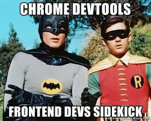

# 0x01. Developer Tools  

> HTML | CSS | Front-end  

This project focuses on **mastering browser developer tools** to enhance **debugging, performance auditing, and real-time editing** of web pages. It covers the fundamentals of **Chrome DevTools, Firefox Developer Tools, Safari Web Inspector, and Edge DevTools**, providing hands-on experience in **modifying HTML and CSS, auditing pages with Lighthouse, analyzing server requests, detecting 404 errors, and optimizing resource usage**. The project aims to improve your ability to **inspect, troubleshoot, and refine web applications** for better performance, accessibility, and user experience.  



In this project, you will analyze this website [https://dev-tools.alx-tools.com/](https://dev-tools.alx-tools.com/).

## Resources :books:

**Read or watch:**

* [Chrome DevTools | Tools for Web Developers | Google Developers](https://developer.chrome.com/docs/devtools/overview)
* [Introduction | Down and Dirty with Chrome Developer Tools](https://blittle.github.io/chrome-dev-tools/)
* [Firefox Developer Tools | MDN](https://firefox-source-docs.mozilla.org/devtools-user/index.html)
* [Dev Tips - Developer Tips by Umar Hansa](https://umaar.com/dev-tips/)
* [Get Started With Viewing And Changing CSS | Tools for Web Developers](https://developer.chrome.com/docs/devtools/css)
* [Keeping it simple with the JavaScript console - LogRocket Blog](https://blog.logrocket.com/keeping-it-simple-with-the-javascript-console/)
* [Inspect Network Activity - Chrome DevTools 101](https://www.youtube.com/watch?v=e1gAyQuIFQo)

## Learning Objectives :bulb:
At the end of this project, you are expected to be able to [explain to anyone](https://fs.blog/feynman-learning-technique/), **without the help of Google:**

### General

* What Developer Tools in your browser are
* How to open the Developer Tools on Chrome, Firefox, Safari, and Edge.
* How to use the elements tab to edit HTML and CSS
* How to audit a page according to the tips suggested by Lighthouse
* How to create and run snippets on a page
* How to get information about files and server configurations
* How to block requests
* How to know how much JavaScript or CSS is used on a page
* How to detect 404 issues
* How to move elements on a webpage

## Requirements

### General

* A `README.md` file, at the root of the folder of the project, is mandatory
* Use the newest version of Google Chrome browser (`78.0.3904.70` or later).
* Screenshots can be taken via the OS, not necessary via the DevTools. These screenshots are used to see how and where you are doing/playing with the DevTools.

## Tasks :card_file_box:

### Mandatory Tasks:

#### 0. Responsive device

Go to [https://dev-tools.alx-tools.com/](https://dev-tools.alx-tools.com/)

Take a screenshot of the website using the device toolbar Choose iPhone X and show the size in your screenshot (selected device or size in pixel of the rendering)

**Repo:**

* GitHub repository: `alx-frontend`
* Directory: `0x01-developer_tools`
* File: [0-responsive_device.png](0-responsive_device.png)

#### 1. Change the background color

Go to [https://dev-tools.alx-tools.com/](https://dev-tools.alx-tools.com/)

Change the background-color of the body to use `#4233bd` Take a screenshot of the `PORTFOLIO` section

**Repo:**

* GitHub repository: `alx-frontend`
* Directory: `0x01-developer_tools`
* File: [1-change_bg_color.png](1-change_bg_color.png)

#### 2. Force element state

Go to [https://dev-tools.alx-tools.com/](https://dev-tools.alx-tools.com/)

Force the hover state of the “cake” block in the section Portfolio Take a screenshot of it

**Repo:**

* GitHub repository: `alx-frontend`
* Directory: `0x01-developer_tools`
* File: [2-pathways_menu.png](2-pathways_menu.png)


#### 3. Copy all the styles of the button

Go to [https://dev-tools.alx-tools.com/](https://dev-tools.alx-tools.com/)

Select the `Download me!` and copy all the CSS styling that is applied on this button.

Your answer file must contain all CSS styling one per line like this example:

```
$ head -2 3-button_styles
border-radius: 1px;
color: #FF00FF;
$
```

**Repo:**

* GitHub repository: `alx-frontend`
* Directory: `0x01-developer_tools`
* File: [3-button_styles](3-button_styles)

#### 4. Change button styles

Go to [https://dev-tools.alx-tools.com/](https://dev-tools.alx-tools.com/)

* All primary buttons (`btn-primary`) should have the `#0080ee` color as a background color
* All outlined buttons light (`btn-outline-light`) should have `#0020aa` for the text color
* Screenshot all buttons that changed and merge it to one image

**Repo:**

* GitHub repository: `alx-frontend`
* Directory: `0x01-developer_tools`
* File: [4-new_buttons.png](4-new_buttons.png)

#### 5. Remove part of the website

Go to [https://dev-tools.alx-tools.com/](https://dev-tools.alx-tools.com/)

Remove the `div` of the “cake” box in the section Portfolio

Take a screenshot of it

**Repo:**

* GitHub repository: `alx-frontend`
* Directory: `0x01-developer_tools`
* File: [5-deleted_elements.png](5-deleted_elements.png)

#### 6. Where is it coming from?

Go to [https://dev-tools.alx-tools.com/](https://dev-tools.alx-tools.com/)

* On the right panel, click on the `Computed tab`
* Then, select the `h2` with the text `ABOUT`
* Search for `margin-bottom`

Which file is coming from that declaration?

**Repo:**

* GitHub repository: `alx-frontend`
* Directory: `0x01-developer_tools`
* File: [6-declaration_file](6-declaration_file)

#### 7. How many listeners

Go to [https://dev-tools.alx-tools.com/](https://dev-tools.alx-tools.com/)

How many times click events are referenced in JavaScript files?

**Repo:**

* GitHub repository: `alx-frontend`
* Directory: `0x01-developer_tools`
* File: [7-number_of_listeners](7-number_of_listeners)

#### 8. What is the HSL code

Go to [https://dev-tools.alx-tools.com/](https://dev-tools.alx-tools.com/)

Select the primary button “Send”

What is the equivalent value of the hexadecimal background-color, in HSL?

(format of your answer should be: `hsl(<VALUES>);`, example: `hsl(241, 23%, 24%);` following by a new line)

**Repo:**

* GitHub repository: `alx-frontend`
* Directory: `0x01-developer_tools`
* File: [8-hsl](8-hsl)

#### 9. The max-width of the container

Go to [https://dev-tools.alx-tools.com/](https://dev-tools.alx-tools.com/)

What is the `max-width` for the first `.container` in the section “About”? (your browser width must be between 1250px and 1440px and with a zoom at 100%)

(format of your answer should be `max-width: <VALUE>;`, example: `max-width: 670px`)

**Repo:**

* GitHub repository: `alx-frontend`
* Directory: `0x01-developer_tools`
* File: [9-max_width](9-max_width)

#### 10. Moving around

Go to [https://dev-tools.alx-tools.com/](https://dev-tools.alx-tools.com/)

Switch the section “About” and “Portfolio”

Take a screenshot of it

**Repo:**

* GitHub repository: `alx-frontend`
* Directory: `0x01-developer_tools`
* File: [10-moved_around.png](10-moved_around.png)

#### 11. Coverage

Go to [https://dev-tools.alx-tools.com/](https://dev-tools.alx-tools.com/)

How many bytes that `freelancer.css` covers?

Answer file must contain the value in Byte (example: `6144` for 6KB)

**Repo:**

* GitHub repository: `alx-frontend`
* Directory: `0x01-developer_tools`
* File: [11-coverage](11-coverage)

#### 12. Emulate the print version of the webpage

Go to [https://dev-tools.alx-tools.com/](https://dev-tools.alx-tools.com/)

Take a screenshot of the homepage, only emulation the CSS print version of the website.

**Repo:**

* GitHub repository: `alx-frontend`
* Directory: `0x01-developer_tools`
* File: [12-print_version.png](12-print_version.png)

#### 13. Using the console

Go to [https://dev-tools.alx-tools.com/](https://dev-tools.alx-tools.com/)

Select the Avatar image in the header and type `$0` in the console. Enter.

What does it return?

**Repo:**

* GitHub repository: `alx-frontend`
* Directory: `0x01-developer_tools`
* File: [13-logo_dollar0](13-logo_dollar0)

#### 14. Write code in the console

Go to [https://dev-tools.alx-tools.com/](https://dev-tools.alx-tools.com/)

Write in the console console.log(document.title), what is returned?

**Repo:**

* GitHub repository: `alx-frontend`
* Directory: `0x01-developer_tools`
* File: [14-doc_title](14-doc_title)

#### 15. Web framework

Go to [https://dev-tools.alx-tools.com/](https://dev-tools.alx-tools.com/)

Which front-end framework could we guess this page is using?

In your answer file only put the letter of the multiple choice answer from below:
    * A. React JS
    * Material Design
    * Bootstrap
    * Angular JS

**Repo:**

* GitHub repository: `alx-frontend`
* Directory: `0x01-developer_tools`
* File: [15-hbtn_framework](15-hbtn_framework)

#### 16. Homepage weight

Go to [https://dev-tools.alx-tools.com/](https://dev-tools.alx-tools.com/)

What is the total weight of the page (with all the elements)?

Take a screenshot of it

**Repo:**

* GitHub repository: `alx-frontend`
* Directory: `0x01-developer_tools`
* File: [16-weight.png](16-weight.png)

#### 17. Number of requests

Go to [https://dev-tools.alx-tools.com/](https://dev-tools.alx-tools.com/)

What is the number of requests done when accessing this page?

Take a screenshot of it

**Repo:**

* GitHub repository: `alx-frontend`
* Directory: `0x01-developer_tools`
* File: [17-requests.png](17-requests.png)

#### 18. Number of CSS files

Go to [https://dev-tools.alx-tools.com/](https://dev-tools.alx-tools.com/)

How many CSS resources are loaded on this page?

**Repo:**

* GitHub repository: `alx-frontend`
* Directory: `0x01-developer_tools`
* File: [18-css_loaded](18-css_loaded)

#### 19. Number of images

Go to [https://dev-tools.alx-tools.com/](https://dev-tools.alx-tools.com/)

How many image resources are loaded on this page?

**Repo:**

* GitHub repository: `alx-frontend`
* Directory: `0x01-developer_tools`
* File: [19-images_loaded](19-images_loaded)

#### 20. Favicon image type

Go to [https://dev-tools.alx-tools.com/](https://dev-tools.alx-tools.com/)

What is the type value of the favicon image?

**Repo:**

* GitHub repository: `alx-frontend`
* Directory: `0x01-developer_tools`
* File: [20-favicon_type](20-favicon_type)

#### 21. Font library

Go to [https://dev-tools.alx-tools.com/](https://dev-tools.alx-tools.com/)

The website uses a font library for their icons, which one is it?

**Repo:**

* GitHub repository: `alx-frontend`
* Directory: `0x01-developer_tools`
* File: [21-hbtn_font_lib](21-hbtn_font_lib)

#### 22. XHR calls

Go to [https://dev-tools.alx-tools.com/](https://dev-tools.alx-tools.com/)

What is the name of the resource that generates 1 XHR calls?

**Repo:**

* GitHub repository: `alx-frontend`
* Directory: `0x01-developer_tools`
* File: [22-xhr_calls](22-xhr_calls)

#### 23. Audits panel

Go to [https://dev-tools.alx-tools.com/](https://dev-tools.alx-tools.com/)

What is the notation for `Performance` (for desktop mode and no throttling - also called Lighthouse)?

Take a screenshot of it

**Repo:**

* GitHub repository: `alx-frontend`
* Directory: `0x01-developer_tools`
* File: [23-performance_audit.png](23-performance_audit.png)

#### 24. Static assets

Go to [https://dev-tools.alx-tools.com/](https://dev-tools.alx-tools.com/)

How many static assets need a better cache policy?

Take a screenshot of it

**Repo:**

* GitHub repository: `alx-frontend`
* Directory: `0x01-developer_tools`
* File: [24-static_assets_audit.png](24-static_assets_audit.png)

#### 25. Accessibility

Go to [https://dev-tools.alx-tools.com/](https://dev-tools.alx-tools.com/)

When you run an accessibility audit, what is the contrast issue?

In your answer file only put the letter of the multiple choice answer from below:
    * A. Image elements do not have [alt] attributes
    * B. Links do not have a discernible name
    * C. Background and foreground colors do not have a sufficient contrast ratio.

**Repo:**

* GitHub repository: `alx-frontend`
* Directory: `0x01-developer_tools`
* File: [25-contrast_issue](25-contrast_issue)

#### 26. No alt

Go to [https://dev-tools.alx-tools.com/](https://dev-tools.alx-tools.com/)

Which classes are on the images that have no `alt` attribute?

Your answer file must contains all classes, example: `.my_class.my_second` if 2 classes

**Repo:**

* GitHub repository: `alx-frontend`
* Directory: `0x01-developer_tools`
* File: [26-no_alt](26-no_alt)

#### 27. Best practices

Go to [https://dev-tools.alx-tools.com/](https://dev-tools.alx-tools.com/)

Which attribute is missing on all the links with the target `_blank`?

In your answer file only put the letter of the multiple choice answer from below:
    * A. `rel="noopener"`
    * B. `rel="noreferrer"`
    * C. A and B
    * D. `rel = "nofollow"`

**Repo:**

* GitHub repository: `alx-frontend`
* Directory: `0x01-developer_tools`
* File: [27-missing_attr](27-missing_attr)

#### 28. SEO

Go to [https://dev-tools.alx-tools.com/](https://dev-tools.alx-tools.com/)

Which `<a>` links don’t have enough text description?

Take a screenshot of it

**Repo:**

* GitHub repository: `alx-frontend`
* Directory: `0x01-developer_tools`
* File: [28-unclear_desc.png](28-unclear_desc.png)

#### 29. Sources

Go to [https://dev-tools.alx-tools.com/](https://dev-tools.alx-tools.com/)

The `sources` panel allow you to edit files, add breakpoints to analyse your JavaScript code and create snippets.

* Create a new snippet called `allcolors.js`
* Copy-paste the code on [that page](https://github.com/bgrins/devtools-snippets/blob/master/snippets/allcolors/allcolors.js)
* Run the code
* Take a screenshot of the result in your console

**Repo:**

* GitHub repository: `alx-frontend`
* Directory: `0x01-developer_tools`
* File: [29-how_many_colors.png](29-how_many_colors.png)

#### 30. Block CSS files

Go to [https://dev-tools.alx-tools.com/](https://dev-tools.alx-tools.com/)

Block all CSS requests

Take a screenshot of it

**Repo:**

* GitHub repository: `alx-frontend`
* Directory: `0x01-developer_tools`
* File: [30-no_css.png](30-no_css.png)

#### 31. Application panel

Go to [https://dev-tools.alx-tools.com/](https://dev-tools.alx-tools.com/)

The `application` panel gives you access to the storage (cookies, sessions, cache…) and some other options as Services Workers and more recently, notifications.

What is the only key present in the session storage for this page?

**Repo:**

* GitHub repository: `alx-frontend`
* Directory: `0x01-developer_tools`
* File: [31-session_storage_key](31-session_storage_key)

#### 32. Service workers

Go to [https://dev-tools.alx-tools.com/](https://dev-tools.alx-tools.com/)

Does this page have any service workers? `Yes` or `No`

**Repo:**

* GitHub repository: `alx-frontend`
* Directory: `0x01-developer_tools`
* File: [32-service_workers](32-service_workers)

#### 33. Security

Go to [https://dev-tools.alx-tools.com/](https://dev-tools.alx-tools.com/)

The `security` panel allows you to make sure HTTS is properly implement on a webpage.

Which organization issued the SSL certificate for this page?

**Repo:**

* GitHub repository: alx-frontend`
* Directory: `0x01-developer_tools`
* File: [33-ssl_cert](33-ssl_cert)

#### 34. Expiration date

Go to [https://dev-tools.alx-tools.com/](https://dev-tools.alx-tools.com/)

When does the SSL certificate expire?

Take a screenshot of it

**Repo:**

* GitHub repository: `alx-frontend`
* Directory: `0x01-developer_tools`
* File: [34-ssl_expiration.png](34-ssl_expiration.png)

---

## Author

* **Peter Opoku-Mensah** ([@deezyfg](https://github.com/deezyfg))

[](https://peter-opoku-mensah.netlify.app)
[](https://twitter.com/coded_issue)
[](https://www.linkedin.com/in/opokumensahpeter/)
[](https://github.com/deezyfg)