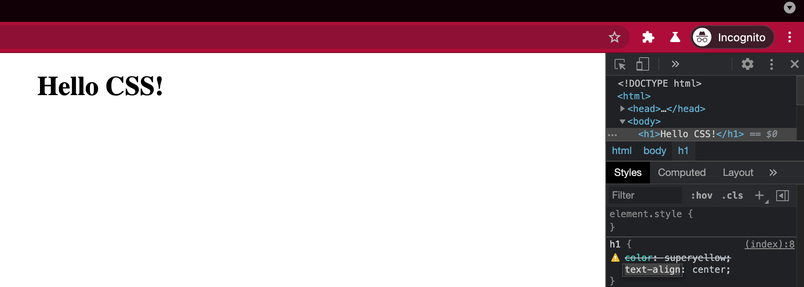

# 0x02. Advanced CSS  

> CSS | Front-end

This project focuses on **mastering advanced CSS techniques** to create **responsive, visually appealing, and performant web designs**. It covers the fundamentals of **CSS selectors, properties, and values**, ensuring consistency across browsers with **CSS resets**, and understanding the differences between **inline, embedded, and external styles**. You’ll learn how to work with **CSS variables, grid systems (including floats), background gradients, animations, and 2D/3D transformations**. The project also emphasizes the use of **icons (webfonts vs. SVGs)**, **pseudo-classes vs. pseudo-elements**, and the role of **vendor prefixes** in creating cross-browser compatible styles.  

## Concepts

For this project, we expect you to look at these concepts:

<details>
<summary><b>CSS fundamentals</summary></b><br>

<br>

## Overview

CSS (Cascading Style Sheets) are used to style HTML.
CSS works by:
    * selecting an HTML element
    * choosing a property to alter
    * applying a certain value

## Syntax

```
element-selector {
 one-style-property: value;
 another-style-property: value;
}
```

A property + value is known as a “declaration”. Like this: `text-align: center;`

In general, and for readability purposes, we tend to put each declaration on separate lines like the example above. Some people argue that is better to put everything (element, property and value) in one line (when it has a single declaration), but you might need to add more declarations in the future. Also, placing each declaration on dedicated lines makes the code a lot easier to read and follow.

## Applying CSS to HTML
There are a couple of ways to apply CSS to a HTML project. Let’s review them.

### External stylesheet
An external stylesheet contains CSS in a separate file with a `.css` extension. This is the most commonly used method of adding CSS to a document. You can also link a single CSS file to multiple web pages, styling all of them with the same CSS stylesheet.

Example of an external stylesheet file linked to the HTML:

```
<!DOCTYPE html>
<html>
  <head>
    <meta charset="utf-8">
    <title>Adding Styles</title>
    <link rel="stylesheet" href="styles.css">
  </head>
  <body>
    <h1>Hello CSS!</h1>
  </body>
</html>
```

The external file could look something like this:

```
h1 {
  color: deepskyblue;
  text-align: center;
}
```

### Internal stylesheet
An internal stylesheet resides within an HTML document. To create an internal stylesheet, just place CSS code inside a `<style>` element contained inside `<head>` element of the HTML.

Example of an internal stylesheet file linked to the HTML:

```
<!DOCTYPE html>
<html>

<head>
  <meta charset="utf-8">
  <title>Adding Styles</title>
  <style>
    h1 {
      color: deepskyblue;
      text-align: center;
    }
  </style>
</head>

<body>
  <h1>Hello CSS!</h1>
</body>

</html>
```

#### Inline styles
Inline styles are CSS declarations that affect a single HTML element, contained within a `style` attribute.

Example of an inline style in an HTML document:

```
<h1 style="color: deepskyblue; text-align: center;">Hello CSS!</h1>
```

**Note:** Inline styles take precedence over stylesheets, so a inline style will always prevail over any other.

### Invalid CSS
You might be wondering what happens if a browser encounters a CSS selector or declaration it doesn’t recognise?

If a browser is parsing your rules, and encounters a property or value that it doesn’t understand, it ignores it and moves on to the next declaration. It will do this if you have mistyped/misspelled a property or value, or if the property or value is just too new and the browser doesn’t yet support it. Similarly, if a browser encounters a selector that it doesn’t understand, it will just ignore the whole rule and move on to the next one.

For this reason, it’s a good idea to [validate your CSS](https://jigsaw.w3.org/css-validator/#validate_by_input). This way, you’ll know right away if something is wrong.

**Tip:** A browser’s developer tools can also highlight invalid property names or values.



Inspecting a heading element with an invalid value using Google Chrome Developer Tools.

## Resources
* [CSS first steps - Learn web development | MDN](https://developer.mozilla.org/en-US/docs/Learn_web_development/Core/Styling_basics)

</details>


<details>
<summary><b>CSS advanced</summary></b><br>

<br>

## Tag vs Class vs Id (Selectors)
Nowadays developers tend to target less IDs in their CSS. The reason behind is that IDs should always be unique on a page. And for a maximum flexibility, the usage of only classes simplify the reusability of parts of the UI.

### Cascading or order

```
* { } /* select all elements */
section /* select all section tags */
.my-class { } /* select all elements with that class */
.my-block > .my-title { }
.my-block + .my-title { }
.my-block ~ .my-title { }
#my-div /* select the element with that ID  */
```

<br>

## Colors
The `color` CSS property sets the color value of a text HTML element.
Colors in CSS are represented most commontly represented by names, hexadecimal or RGB values.

### Accessibility tip
When choosing colors for your design, you should always take accessibility into consideration. Modern browsers have now an [easy way to show if a color is accessible or not](https://uxdesign.cc/chrome-devtools-accessible-colors-300ec462a63c?gi=5ef2c500a1a7)

### Code example

```
p { color: red; }
p { color: #f00; }
p { color: #ff0000; }
p { color: rgb(255,0,0); }
p { color: rgb(100%, 0%, 0%); }
p { color: hsl(0, 100%, 50%); }
```

### Resources
* [color - CSS: Cascading Style Sheets | MDN](https://developer.mozilla.org/en-US/docs/Web/CSS/color)
* [List of colors](https://developer.mozilla.org/en-US/docs/Web/CSS/color_value)
* [Colors - A nicer color palette for the web.](https://clrs.cc/)
* [Color Names — HTML Color Codes](https://htmlcolorcodes.com/color-names/)
* [CSS colour names](https://colours.neilorangepeel.com/)
* [rgb(112, 128, 144) ✿ CSS.coloratum](https://projects.verou.me/css-colors/#slategray)

<br>

## CSS Variables
Custom properties or also called `CSS variables` represent custom properties that contain a value that can be reused across declarations.

### Resources
* [var() - CSS: Cascading Style Sheets | MDN](https://developer.mozilla.org/en-US/docs/Web/CSS/var)
* [Custom properties (–*): CSS variables - CSS: Cascading Style Sheets | MDN](https://developer.mozilla.org/en-US/docs/Web/CSS/--*)

### Code example

```
:root {
  --main-bg-color: blue;
}
body {
  color: var(--main-bg-color);
}
```

<br>

## Units and Values
Multiple CSS units can be used in your CSS. `px` is the one of the most commonly used, and is also an absolute unit, in contrast with relative length units like `rem`.

Both (absolute and relative) are used in different contexts.

`rem`: font size, padding, margin `em`: media queries

### Warning!
REM is relative to the root element: the `<html>` tag not `<body>` tag

### Code example

```
font-size: 2rem;
padding: 1.2rem 2rem;
```

### Resources
* [CSS values and units - Learn web development | MDN](https://developer.mozilla.org/en-US/docs/Learn_web_development/Core/Styling_basics/Values_and_units)

<br>

## Line-height
The `line-height` CSS property sets the height between lines of text.

### Accessibility tip
Use a minimun of 1.5 for line-height for main paragraph content. It will help people with low vision conditions to easily read your content.

### Resources
* [line-height - CSS: Cascading Style Sheets | MDN](https://developer.mozilla.org/en-US/docs/Web/CSS/line-height)
* [Deep dive CSS: font metrics, line-height and vertical-align - Vincent De Oliveira](https://iamvdo.me/en/blog/css-font-metrics-line-height-and-vertical-align)
* [How CSS line-height works and best practices - DEV Community 👩‍💻👨‍💻](https://dev.to/lampewebdev/css-line-height-jjp)
* [Unitless line-heights – Eric’s Archived Thoughts](https://meyerweb.com/eric/thoughts/2006/02/08/unitless-line-heights/)

### Code example

```
p {
    line-height: 1;
}
```

<br>

## Text decoration
The `text-decoration` shorthand CSS property sets the appearance of decorative lines on text.

### Resources
* [text-decoration - CSS: Cascading Style Sheets | MDN](https://developer.mozilla.org/en-US/docs/Web/CSS/text-decoration)

### Code example

```
a {
  text-decoration: line-through;
}
```

<br>

## Text align
The `text-align` CSS property sets the horizontal alignment of a BLOCK element.

### Resources
* [text-align - CSS: Cascading Style Sheets | MDN](https://developer.mozilla.org/en-US/docs/Web/CSS/text-align)

<br>

## Text transform
The `text-transform` CSS property allow to capitalize a text element.

### Resources
* [text-transform - CSS: Cascading Style Sheets | MDN](https://developer.mozilla.org/en-US/docs/Web/CSS/text-transform)

### Code example

```
p {
  text-transform: lowercase;
}
```

<br>

## Letter spacing
The `letter-spacing` CSS property sets the spacing behavior between text characters.

### Resources
* [letter-spacing - CSS: Cascading Style Sheets | MDN](https://developer.mozilla.org/en-US/docs/Web/CSS/letter-spacing)

### Code example

```
a {
  letter-spacing: -0.4rem;
}
```

<br>

## Pseudo Classes
A CSS `pseudo-class` is a keyword you can add to a selector. It specifies a different **state** of the element.

```
selector:pseudo-class {
  property: value;
}
```

Don’t confuse `pseudo-classes` with `pseudo-elements`. Pseudo-classes uses one `:` and pseudo-elements `::` (it’s a way to distinguish both, even you could use single `:` for pseudo-elements).

### Resources
* [Pseudo-classes - CSS: Cascading Style Sheets | MDN](https://developer.mozilla.org/en-US/docs/Web/CSS/Pseudo-classes)
* [:active - CSS: Cascading Style Sheets | MDN](https://developer.mozilla.org/en-US/docs/Web/CSS/:active)
* [:hover - CSS: Cascading Style Sheets | MDN](https://developer.mozilla.org/en-US/docs/Web/CSS/:hover)

### Code example
Always remember the LVHA-order or LoVe, HAte for `Link, Visited, Hover, Active`

```
/* a:link or just a */
a:link {
  color: green;
}
/* when you have already clicked and visited the link / page */
a:visited {
  color: cadetblue;
}
/* any link over which the user's pointer is hovering */
a:hover {
  text-decoration: underline;
}
a:active {
  color: darkcyan;
}
```

<br>

## CSS Reset/Normalize
The expression CSS reset came from Eric Meyer who created a reset stylesheet in 2007, to reduce browser inconsistencies.

Since then, different solutions came out: Normalize.css, sanitize.css, reboot for Bootstrap…

### Resources
* [CSS Tools: Reset CSS](https://meyerweb.com/eric/tools/css/reset/)
* [Normalize CSS or CSS Reset?! - Elad Shechter - Medium](https://elad.medium.com/normalize-css-or-css-reset-9d75175c5d1e)
* [Reboot, Resets, and Reasoning | CSS-Tricks](https://css-tricks.com/reboot-resets-reasoning/)
* [HTML Kitchen-sink](https://codepen.io/chriscoyier/pen/JpLzjd)

<br>

## Box Model
The `box-model` is one of the fundamental you need to understand. It’s the key to understand how to create layouts in CSS and how elements align in the page.

## Resources
* [Introduction to the CSS basic box model - CSS: Cascading Style Sheets | MDN](https://developer.mozilla.org/en-US/docs/Web/CSS/CSS_box_model/Introduction_to_the_CSS_box_model)
* [width - CSS: Cascading Style Sheets | MDN](https://developer.mozilla.org/en-US/docs/Web/CSS/width)
* [height - CSS: Cascading Style Sheets | MDN](https://developer.mozilla.org/en-US/docs/Web/CSS/height)
* [padding - CSS: Cascading Style Sheets | MDN](https://developer.mozilla.org/en-US/docs/Web/CSS/padding)
* [margin - CSS: Cascading Style Sheets | MDN](https://developer.mozilla.org/en-US/docs/Web/CSS/margin)

### Code example

```
/* This is the box-sizing by default */
.box {
  box-sizing: content-box;
}
/* This is the box-sizing value we usually use to create layouts */
.box {
  box-sizing: border-box;
}
/* This box has dimensions, padding and margin */
.box-dimensions {
  width: 100px;
  height: 50px;
  padding-top: 30px;
  margin: 5px;
}
```

## CSS Flow and Display
Normal Flow, or Flow Layout, is the way that Block and Inline elements are displayed on a page before any changes are made to their layout.

### Resources
* [CSS Flow Layout - CSS: Cascading Style Sheets | MDN](https://developer.mozilla.org/en-US/docs/Web/CSS/CSS_flow_layout)
* [Block and inline layout in normal flow - CSS: Cascading Style Sheets | MDN](https://developer.mozilla.org/en-US/docs/Web/CSS/CSS_flow_layout/Block_and_inline_layout_in_normal_flow)

<br>

## Grid System
Grid systems started to be used to layout books and magazines. They started to be used more recently to also create and define website’s layout. Before flexbox and css grid, grid systems were using floats to organize the content.

### Warning
Before CSS Grid, developers were already using the word grid to define the responsive grid system used to build websites.

### Resources
* [Floats Tutorial | HTML & CSS Is Hard](https://internetingishard.com/html-and-css/floats/)
* [960 Grid System](https://960.gs/)
* [What are Frameworks? 22 Best Responsive CSS Frameworks for Web Design](https://www.awwwards.com/what-are-frameworks-22-best-responsive-css-frameworks-for-web-design.html)
* [All About Floats | CSS-Tricks](https://css-tricks.com/all-about-floats/)

<br>

### Pseudo Elements
A CSS `pseudo-element` is a keyword added to a selector that lets you style a specific part of this element.

```
selector::pseudo-class {
  property: value;
}
```

### Resources
* [Pseudo-elements - CSS: Cascading Style Sheets | MDN](https://developer.mozilla.org/en-US/docs/Web/CSS/Pseudo-elements)
* [::before and ::after pseudo-elements explained - DEV Community 👩‍💻👨‍💻](https://dev.to/therajatg/pseudo-elements-before-and-after-15j2)
* [::before (:before) - CSS: Cascading Style Sheets | MDN](https://developer.mozilla.org/en-US/docs/Web/CSS/::before)
* [::after (:after) - CSS: Cascading Style Sheets | MDN](https://developer.mozilla.org/en-US/docs/Web/CSS/::after)
* [A Single Div](https://a.singlediv.com/)
* [A new micro clearfix hack – Nicolas Gallagher](https://nicolasgallagher.com/micro-clearfix-hack/)

### Code example

```
/* Add an arrow as the last child of the link */
a::after {
  content: '→';
}
/* Change the font size of the first letter within all paragraphs */
p::first-letter {
  font-size: 130%;
}
```

<br>

## Attribute Selectors
The `attribute selectors` allow you to target an attribute found on an HTML element.

### Resources
* [Attribute selectors - CSS: Cascading Style Sheets | MDN](https://developer.mozilla.org/en-US/docs/Web/CSS/Attribute_selectors)
* [attribute CSS-Tricks](https://css-tricks.com/almanac/selectors/a/attribute/)
* [Splicing HTML’s DNA With CSS Attribute Selectors — Smashing Magazine](https://www.smashingmagazine.com/2018/10/attribute-selectors-splicing-html-dna-css/)
* [Attribute Selectors | Codrops CSS Reference](https://tympanus.net/codrops/css_reference/attribute-selectors/)

### Code example

```
/* Links with "facebook" anywhere in the URL */
a[href*="facebook"] {
  color: #3C5A99;
}
/* Internal links, beginning with "#" */
a[href^="#"] {
  background-color: gold;
}
/* Links that end in ".org" */
a[href$=".org"] {
  color: red;
}
```

<br>

## Background
The `background` [shorthand](https://developer.mozilla.org/en-US/docs/Web/CSS/Shorthand_properties) [CSS](https://developer.mozilla.org/en-US/docs/Web/CSS) property sets all background style properties at once, such as color, image, origin and size, or repeat method. Component properties not set in the `background` shorthand property value declaration are set to their default values.

### Resources
* [background - CSS: Cascading Style Sheets | MDN](https://developer.mozilla.org/en-US/docs/Web/CSS/background)

### Code example

```
.box {
  background: ;
}
lineargradient
image
```

<br>

## Borders
The `border` shorthand CSS property sets an element’s border.

### Resources
* [border - CSS: Cascading Style Sheets | MDN](https://developer.mozilla.org/en-US/docs/Web/CSS/border)
* [outline - CSS: Cascading Style Sheets | MDN](https://developer.mozilla.org/en-US/docs/Web/CSS/outline)
* [border-radius | CSS-Tricks](https://css-tricks.com/almanac/properties/b/border-radius/)

### Code example

```
.box {
  display: block;
  padding: 1rem;
  border-width: 2px;
  border-style: double;
  border-color: orange;
  border-radius: 12px;
}
/* shorthand version */
.box {
  display: block;
  padding: 1rem;
  border-width: 2px double orange;
  border-radius: 12px;
}
```

<br>

## Position
`Positioning` in CSS requires to use different CSS properties that allow you to position elements in your HTML webpage.

### Resources
* [Positioning - CSS Reference](https://cssreference.io/positioning/)
* [CSS Positioning 101 – A List Apart](https://alistapart.com/article/css-positioning-101/)
* [A Detailed Look at the z-index CSS Property - Impressive Webs](https://www.impressivewebs.com/a-detailed-look-at-the-z-index-css-property/)
* [position | CSS-Tricks](https://css-tricks.com/almanac/properties/p/position/)
* [CSS Position Sticky - How It Really Works! - Elad Shechter - Medium](https://elad.medium.com/css-position-sticky-how-it-really-works-54cd01dc2d46)

### Code example

```
/* not 100% browser support yet, but could be user in some cases */
.component {
  position: sticky;
  top: 0;
}
```

<br>

## CSS Transform
The `transform` CSS properties allow you to rotate, scale, skew, or translate an element.

### Resources
* [transform - CSS: Cascading Style Sheets | MDN](https://developer.mozilla.org/en-US/docs/Web/CSS/transform)
* [CSS Transform Functions Visualizer](https://css-transform.moro.es/)

### Code example

```
transform: perspective(17px);
transform: rotate3d(1, 2.0, 3.0, 10deg);
transform: translate(12px, 50%);
transform: scale(2, 0.5);
transform: skew(30deg, 20deg);
```

<br>

## CSS Animation
The `animation` CSS properties allow you to animate other property of an element.

### Warning!
Animation is a shorthand property. Only animation-duration and animation-name are required.

### Resources
* [CSS Animations - CSS: Cascading Style Sheets | MDN](https://developer.mozilla.org/en-US/docs/Web/CSS/CSS_animations)
* [Using CSS animations - CSS: Cascading Style Sheets | MDN](https://developer.mozilla.org/en-US/docs/Web/CSS/CSS_animations/Using_CSS_animations)
* [Awesome CSS3 animation](https://coolcssanimation.com/)
* [Animate.css](https://animate.style/)
* [The best CSS animation examples to recreate | Creative Bloq](https://www.creativebloq.com/inspiration/css-animation-examples)

### Code example

```
@keyframes example {
  from {
    background-color: blue;
  }
  to {
    background-color: red;
  }
}
.box {
  width: 10rem;
  height: 10rem;
  background-color: blue;
  animation-name: example;
  animation-duration: 3s;
}
```

</details>


## Resources :books:

**Read or watch:**

* [CSS Reference - A free visual guide to CSS](https://cssreference.io/)
* [Can I use,,, Support tables for HTML5, CSS3, etc](https://caniuse.com/)
* [CSS Reference](https://ref.openweb.io/CSS/)
* [CSS Properties | HTML Dog](https://htmldog.com/references/css/properties/)
* [Box Sizing](https://css-tricks.com/box-sizing/)
* [CSS specificity calculator](https://codecaptain.io/tools/css-specificity-calculator)
* [Play with CSS selector](https://frontend30.com/css-selectors-cheatsheet/)

## Learning Objectives :bulb:
At the end of this project, you are expected to be able to [explain to anyone](https://fs.blog/feynman-learning-technique/), **without the help of Google:**
* Selectors, properties, and values
* The difference between block and inline styling
* How to ensure consistency across all browers (CSS reset)
* How to setup CSS variables
* The differences between inline, embeded and external CSS
* How grid systems work (with floats)
* The difference between icons webfonts and SVG icons
* The difference between pseudo-classes and pseudo-elements
* How to make background gradients
* How to animate elements in CSS
* How to transform (2d, 3d) elements
* What vendor prefixes are

## Requirements

### General
* Allowed editors: `vi`, `vim`, `emacs`, `VSCode`, `Atom`
* All your files will be interpreted on Chrome (version 78.x)
* All your files should end with a new line
* All your files should start by a comment describing the task
* A `README.md` file, at the root of the folder of the project, is mandatory
* Your code should be W3C compliant and validate with [W3C-Validator](https://github.com/alx-tools/W3C-Validator)

### Files you need for the project

`favicon.jpg`


[download favicon.jpg](images/favicon.jpg)

<br>

`logo-black.png`


[download logo-black.png](images/logo-black.png)

<br>

`logo-white.png`


[download logo-white.png](images/logo-white.png)

Store all these under a directory named **“images”**

Use the following starter HTML file for your project.

```
<!DOCTYPE html>
<html lang="en" dir="ltr">
  <head>
    <meta charset="utf-8">
    <meta name="viewport" content="width=device-width, initial-scale=1, viewport-fit=cover">
    <title>Homepage - Techium</title>
    <meta name="description" content="Description of the page less than 150 characters">
    <link rel="icon" type="image/png" href="images/favicon.jpg">
    <link href="https://fonts.googleapis.com/css?family=Open+Sans:400,700|Raleway:700&display=swap" rel="stylesheet">
    <link rel='stylesheet' href='#'>
  </head>
  <body>
    <!-- Header -->
    <header class="header" data-section-theme="dark">
      <div class="container">
        <div class="header-logo">
          <a href="#">
            
          </a>
        </div>
        <nav class="navbar-menu">
          <ul class="nav">
            <li class="nav-item">
              <a href="#" class="nav-link">Home</a>
            </li>
            <li class="nav-item">
              <a href="#services" class="nav-link">Services</a>
            </li>
            <li class="nav-item">
              <a href="#works" class="nav-link">Works</a>
            </li>
            <li class="nav-item">
              <a href="#about" class="nav-link">About</a>
            </li>
            <li class="nav-item">
              <a href="#latest_news" class="nav-link">Latest news</a>
            </li>
            <li class="nav-item">
              <a href="#testimonials" class="nav-link">Testimonials</a>
            </li>
            <li class="nav-item">
              <a href="#contact" class="nav-link">Contact</a>
            </li>
          </ul>
        </nav>
      </div>
    </header>
    <!-- Main -->
    <main>
      <h1 class="visually-hidden">Homepage</h1>
      <!-- Hero section -->
      <section class="section-hero" data-section-theme="dark">
        <div class="container">
          <div class="section-body">
            <section class="section-inner">
              <h2 class="section-title">We help you build your brand</h2>
              <a href="#" class="button">Get Started</a>
            </section>
          </div>
        </div>
      </section>
      <!-- Services section -->
      <section id="services" class="section">
        <div class="container">
          <header class="section-header">
            <h2 class="section-title">Services</h2>
            <p class="section-tagline">We work with you</p>
          </header>
          <div class="section-body">
            <ul class="row">
              <li class="col-1-3">
                <div class="card-services">
                  <h3 class="card-title"><a href="#">Design & Concept</a></h3>
                </div>
              </li>
              <li class="col-1-3">
                <div class="card-services">
                  <h3 class="card-title"><a href="#">Digital Strategy</a></h3>
                </div>
              </li>
              <li class="col-1-3">
                <div class="card-services">
                  <h3 class="card-title"><a href="#">Content Strategy</a></h3>
                </div>
              </li>
            </ul>
            <ul class="row">
              <li class="col-1-3">
                <div class="card-services">
                  <h3 class="card-title"><a href="#">UX Design</a></h3>
                </div>
              </li>
              <li class="col-1-3">
                <div class="card-services">
                  <h3 class="card-title"><a href="#">Web Development</a></h3>
                </div>
              </li>
              <li class="col-1-3">
                <div class="card-services">
                  <h3 class="card-title"><a href="#">Social Media</a></h3>
                </div>
              </li>
            </ul>
          </div>
        </div>
      </section>
      <!-- Works section -->
      <section id="works" class="section" data-section-theme="dark">
        <div class="container">
          <header class="section-header">
            <h2 class="section-title">Works</h2>
            <p class="section-tagline">Take a look at our portfolio</p>
          </header>
          <div class="section-body">
            <ul class="row">
              <li class="col-1-3">
                <article class="card-work">
                  <div class="card-outer">
                    <div class="card-image">
                      
                    </div>
                    <div class="card-inner">
                      <h3 class="card-title"><a href="#">Interior Design</a></h3>
                    </div>
                  </div>
                </article>
              </li>
              <li class="col-1-3">
                <article class="card-work">
                  <div class="card-outer">
                    <div class="card-image">
                      
                    </div>
                    <div class="card-inner">
                      <h3 class="card-title"><a href="#">Web Development</a></h3>
                    </div>
                  </div>
                </article>
              </li>
              <li class="col-1-3">
                <article class="card-work">
                  <div class="card-outer">
                    <div class="card-image">
                      
                    </div>
                    <div class="card-inner">
                      <h3 class="card-title"><a href="#">Personal Development</a></h3>
                    </div>
                  </div>
                </article>
              </li>
            </ul>
          </div>
        </div>
      </section>
      <!-- About Us section -->
      <section id="about" class="section">
        <div class="container">
          <header class="section-header">
            <h2 class="section-title">About Us</h2>
            <p class="section-tagline">Everything about us</p>
          </header>
          <div class="section-body">
            <div class="row">
              <div class="col-1-2">
                
              </div>
              <div class="col-1-2">
                <h3>Who are we</h3>
                <p>Lorem ipsum dolor sit amet, consectetur adipisicing elit. Ipsum, omnis expedita! Eum, praesentium cumque accusantium rem, sit quaerat est nisi ratione, deserunt ducimus quidem iste dicta quibusdam atque maxime cum!</p>
                <h3>Our culture</h3>
                <p>Lorem ipsum dolor sit amet, consectetur adipisicing elit. Ipsum, omnis expedita! Eum, praesentium cumque accusantium rem, sit quaerat est nisi ratione, deserunt ducimus quidem iste dicta quibusdam atque maxime cum!</p>
                <h3>How we work</h3>
                <p>Lorem ipsum dolor sit amet, consectetur adipisicing elit. Ipsum, omnis expedita! Eum, praesentium cumque accusantium rem, sit quaerat est nisi ratione, deserunt ducimus quidem iste dicta quibusdam atque maxime cum!</p>
              </div>
            </div>
          </div>
          <div class="section-footer">
            <a href="#" class="button">Learn more about us</a>
          </div>
        </div>
      </section>
      <!-- Latest news section -->
      <section id="latest_news" class="section">
        <div class="container">
          <header class="section-header">
            <h2 class="section-title">Latest News</h2>
          </header>
          <div class="section-body">
            <ul class="row">
              <li class="col-1-3">
                <article class="card-blog">
                  <div>
                    
                  </div>
                  <p class="card-category">Career</p>
                  <h3><a href="#">Hoc loco tenere se Triarius non potuit.</a></h3>
                  <p>Lorem ipsum dolor sit amet, consectetur adipiscing elit. Id Sextilius factum negabat. Quo tandem modo? At eum nihili facit; Quae contraria sunt his, malane?</p>
                  <small>By Kelly D.</small>
                </article>
              </li>
              <li class="col-1-3">
                <article class="card-blog">
                  <div>
                    
                  </div>
                  <p class="card-category">Digital Life</p>
                  <h3><a href="#">Ut alios omittam, hunc appello, quem ille unum secutus est.</a></h3>
                  <p>Lorem ipsum dolor sit amet, consectetur adipiscing elit. Tum mihi Piso: Quid ergo? Tum ille: Ain tandem? Non autem hoc: igitur ne illud quidem. Sed quod proximum fuit non vidit. Nos commodius agimus. An nisi populari fama?</p>
                  <small>By William A.</small>
                </article>
              </li>
              <li class="col-1-3">
                <article class="card-blog">
                  <div>
                    
                  </div>
                  <p class="card-category">Social</p>
                  <h3><a href="#">Bestiarum vero nullum iudicium puto.</a></h3>
                  <p>Lorem ipsum dolor sit amet, consectetur adipiscing elit. Non igitur bene. Quid enim est a Chrysippo praetermissum in Stoicis? Pugnant Stoici cum Peripateticis. Prioris generis est docilitas, memoria; Apparet statim, quae sint officia, quae actiones.</p>
                  <small>By Frances J.</small>
                </article>
              </li>
            </ul>
          </div>
        </div>
      </section>
      <!-- Testimonials section -->
      <section id="testimonials" class="section">
        <div class="container">
          <header class="section-header">
            <h2 class="section-title">Testimonials</h2>
            <p class="section-tagline">We are more than a digital company</p>
          </header>
          <div class="section-body">
            <ul class="row">
              <li class="col-1-3">
                <article class="card-testimonial">
                  
                  <blockquote class="card-quote">
                    <p>I am completely blown away. Thanks to Techium, we've just launched our 5th website!
                      <cite>Yuri Y.</cite>
                    </p>
                  </blockquote>
                </article>
              </li>
              <li class="col-1-3">
                <article class="card-testimonial">
                  
                  <blockquote class="card-quote">
                    <p>Thank you so much for your help. Techium company is awesome!
                      <cite>Dorrie S.</cite>
                    </p>
                  </blockquote>
                </article>
              </li>
              <li class="col-1-3">
                <article class="card-testimonial">
                  
                  <blockquote class="card-quote">
                    <p>I love your system. Definitely worth the investment. I'd be lost without Techium company.
                      <cite>Sven H.</cite>
                    </p>
                  </blockquote>
                </article>
              </li>
            </ul>
          </div>
        </div>
      </section>
      <!-- Contact section -->
      <section id="contact" class="section">
        <div class="container">
          <header class="section-header">
            <h2 class="section-title">Contact</h2>
            <p class="section-tagline">We'd love to hear from you!</p>
          </header>
          <div class="section-body">
            <p>Lorem ipsum dolor sit amet, consectetur adipiscing elit. Id Sextilius factum negabat. Quo tandem modo? At eum nihili facit; Quae contraria sunt his, malane?</p>
          </div>
          <div class="section-footer">
            <a href="#" class="button">Get in touch</a>
          </div>
        </div>
      </section>
            </main>
    <!-- Footer -->
    <footer class="footer" data-section-theme="dark">
      <div  class="container">
        <div class="row">
          <div class="col-1-2">
            
            <address class="footer-address">
              972 Mission St<br>
              San Francisco, CA<br>
              94103
            </address>
          </div>
          <div class="col-1-2">
            <ul class="social nav">
              <li class="social-item nav-item">
                <a href="https://www.facebook.com/School/" class="social-link">
                  <svg viewbox="0 0 24 24" xmlns="http://www.w3.org/2000/svg" width="25" height="25">
                    <title>
                      Facebook icon
                    </title>
                    <path d="M23.998 12c0-6.628-5.372-12-11.999-12C5.372 0 0 5.372 0 12c0 5.988 4.388 10.952 10.124 11.852v-8.384H7.078v-3.469h3.046V9.356c0-3.008 1.792-4.669 4.532-4.669 1.313 0 2.686.234 2.686.234v2.953H15.83c-1.49 0-1.955.925-1.955 1.874V12h3.328l-.532 3.469h-2.796v8.384c5.736-.9 10.124-5.864 10.124-11.853z"/>
                  </svg>
                </a>
              </li>
              <li class="social-item nav-item">
                <a href="https://twitter.com/school" class="social-link">
                  <svg viewbox="0 0 24 24" xmlns="http://www.w3.org/2000/svg" width="25" height="25">
                    <title>
                      Twitter icon
                    </title>
                    <path d="M23.954 4.569a10 10 0 0 1-2.825.775 4.958 4.958 0 0 0 2.163-2.723c-.951.555-2.005.959-3.127 1.184a4.92 4.92 0 0 0-8.384 4.482C7.691 8.094 4.066 6.13 1.64 3.161a4.822 4.822 0 0 0-.666 2.475c0 1.71.87 3.213 2.188 4.096a4.904 4.904 0 0 1-2.228-.616v.061a4.923 4.923 0 0 0 3.946 4.827 4.996 4.996 0 0 1-2.212.085 4.937 4.937 0 0 0 4.604 3.417 9.868 9.868 0 0 1-6.102 2.105c-.39 0-.779-.023-1.17-.067a13.995 13.995 0 0 0 7.557 2.209c9.054 0 13.999-7.496 13.999-13.986 0-.209 0-.42-.015-.63a9.936 9.936 0 0 0 2.46-2.548l-.047-.02z"/>
                  </svg>
                </a>
              </li>
              <li class="social-item nav-item">
                <a href="https://www.instagram.com/school/" class="social-link">
                  <svg viewbox="0 0 24 24" xmlns="http://www.w3.org/2000/svg" width="25" height="25">
                    <title>
                      Instagram icon
                    </title>
                    <path d="M12 0C8.74 0 8.333.015 7.053.072 5.775.132 4.905.333 4.14.63c-.789.306-1.459.717-2.126 1.384S.935 3.35.63 4.14C.333 4.905.131 5.775.072 7.053.012 8.333 0 8.74 0 12s.015 3.667.072 4.947c.06 1.277.261 2.148.558 2.913a5.885 5.885 0 0 0 1.384 2.126A5.868 5.868 0 0 0 4.14 23.37c.766.296 1.636.499 2.913.558C8.333 23.988 8.74 24 12 24s3.667-.015 4.947-.072c1.277-.06 2.148-.262 2.913-.558a5.898 5.898 0 0 0 2.126-1.384 5.86 5.86 0 0 0 1.384-2.126c.296-.765.499-1.636.558-2.913.06-1.28.072-1.687.072-4.947s-.015-3.667-.072-4.947c-.06-1.277-.262-2.149-.558-2.913a5.89 5.89 0 0 0-1.384-2.126A5.847 5.847 0 0 0 19.86.63c-.765-.297-1.636-.499-2.913-.558C15.667.012 15.26 0 12 0zm0 2.16c3.203 0 3.585.016 4.85.071 1.17.055 1.805.249 2.227.415.562.217.96.477 1.382.896.419.42.679.819.896 1.381.164.422.36 1.057.413 2.227.057 1.266.07 1.646.07 4.85s-.015 3.585-.074 4.85c-.061 1.17-.256 1.805-.421 2.227a3.81 3.81 0 0 1-.899 1.382 3.744 3.744 0 0 1-1.38.896c-.42.164-1.065.36-2.235.413-1.274.057-1.649.07-4.859.07-3.211 0-3.586-.015-4.859-.074-1.171-.061-1.816-.256-2.236-.421a3.716 3.716 0 0 1-1.379-.899 3.644 3.644 0 0 1-.9-1.38c-.165-.42-.359-1.065-.42-2.235-.045-1.26-.061-1.649-.061-4.844 0-3.196.016-3.586.061-4.861.061-1.17.255-1.814.42-2.234.21-.57.479-.96.9-1.381.419-.419.81-.689 1.379-.898.42-.166 1.051-.361 2.221-.421 1.275-.045 1.65-.06 4.859-.06l.045.03zm0 3.678a6.162 6.162 0 1 0 0 12.324 6.162 6.162 0 1 0 0-12.324zM12 16c-2.21 0-4-1.79-4-4s1.79-4 4-4 4 1.79 4 4-1.79 4-4 4zm7.846-10.405a1.441 1.441 0 0 1-2.88 0 1.44 1.44 0 0 1 2.88 0z"/>
                  </svg>
                </a>
              </li>
            </ul>
          </div>
        </div>
        <hr>
        <div class="row">
          <div class="col-1-2">
            <p class="footer-copyright">© 2020 Techium, made with ♥ by students at School.</p>
          </div>
          <div class="col-1-2">
            <ul class="footer-nav nav">
              <li class="footer-nav-item nav-item">
                <a href="#" class="footer-nav-link">Terms of use</a>
              </li>
              <li class="footer-nav-item nav-item">
                <a href="#" class="footer-nav-link">Privacy Policy</a>
              </li>
              <li class="footer-nav-item nav-item">
                <a href="#" class="footer-nav-link">Cookie Policy</a>
              </li>
            </ul>
          </div>
        </div>
      </div>
    </footer>
  </body>
</html>
```

You can save it in a `index.html` file and replace the `<link rel='stylesheet' href='#'>` by the right CSS file.

# End goal of the project


Important note: **details are important!** lowercase vs uppercase / wrong letter… be careful!

## Tasks :card_file_box:

### Mandatory Tasks:

#### 0. Let's get some images!

The description of the project contains some inspiration for the final look of the project but we’ll have to download some images.

Head to [unsplash](https://unsplash.com/) and download 10 high resolution images that look as close to the final product that you’re going to make. You will be using these same high res images for a project on `Responsive Design` in the future. Remember to also include the 3 images (the 2 logos and the favicon) linked in the description of the project.

The images should all be representative of category they belong to. Images in the `work` category should be closely related to `work.`

**Repo:**

* GitHub repository: `alx-frontend`
* Directory: `0x02-CSS_advanced`
* File: [images/pic-about-01.jpg](images/pic-about-01.jpg), [images/pic-work-01.jpg](images/pic-work-01.jpg), [images/pic-work-02.jpg](images/pic-work-02.jpg), [images/pic-work-03.jpg](images/pic-work-03.jpg), [images/pic-article-01.jpg](images/pic-article-01.jpg), [images/pic-article-02.jpg](images/pic-article-02.jpg), [images/pic-article-03.jpg](images/pic-article-03.jpg), [images/pic-person-01.jpg](images/pic-person-01.jpg), [images/pic-person-02.jpg](images/pic-person-02.jpg), [images/pic-person-03.jpg](images/pic-person-03.jpg)

#### 1. Effortless transitions when scrolling

When scrolling is triggered on the `html` element itself, we’d like the behavior of the scroll to be as fluid as possible.

**Repo:**

* GitHub repository: `alx-frontend`
* Directory: `0x02-CSS_advanced`
* File: [styles/1-style.css](styles/1-style.css)

#### 2. Do you know your color values?

Based on [styles/1-style.css](styles/1-style.css), create the following declarations:

* For the `body`, set the foreground color value to `#161616`
* For all anchor elements, set the foreground color value to `#161616`
* All elements with the class `visually-hidden` should have their display to `none`
* All elements with the class `card-category`, should have their foreground color set to` #D73953`
* All elements with the class `section-tagline` should have their foreground color set to `#D73953`

**Repo:**

* GitHub repository: `alx-frontend`
* Directory: `0x02-CSS_advanced`
* File: [styles/2-style.css](styles/2-style.css)

#### 3. Reuse and repeat. A programmer's life should be simple with variables

Based on [styles/2-style.css](styles/2-style.css):

* Target the `root` element and define the following custom properties:
    * `color-primary` set to `#d73953`
    * `color-black` set to `#090909`
    * `color-white` set to `#ffffff`
    * `color-light-grey` set to `#f3f3f3`
    * `color-dark-grey` set to `#353535`
    * `text-color` set to `color-black`
* Revisit the `section-tagline` and `card-category` declarations and reset their color to `color-primary`
* Revisit the `body` and anchor declarations and reset their color to `text-color`

**Does not have to pass w3c**

**Repo:**

* GitHub repository: `alx-frontend`
* Directory: `0x02-CSS_advanced`
* File: [styles/3-style.css](styles/3-style.css)

#### 4. Variables for storing certain font types

Based on [styles/3-style.css](styles/3-style.css):

* Targeting the `root` element, create 2 custom font-family properties `font-family-base` and `font-family-title` with the same list of fonts:
    * set the first choice font as `Helvetica Neue`
    * set the second choice font as `Helvetica`
    * set the third choice font as `Arial`
    * set the last choice font as `sans-serif`
* Set `body`‘s font-family to `font-family-base`
* Create a new declaration targeting all 6 levels of section headings, positioned before the links declaration
    * set its font-family to `font-family-title`

**Does not need to pass W3C**

**Repo:**

* GitHub repository: `alx-frontend`
* Directory: `0x02-CSS_advanced`
* File: [styles/4-style.css](styles/4-style.css)

#### 5. Variables for the font size

Based on [styles/4-style.css](styles/4-style.css):

* Targeting the `root` selector, create the following custom properties:
    * `font-size-small` set to `1.2rem`
    * `font-size-medium` set to `1.6rem`
    * `font-size-large` set to `1.8rem`
    * `font-size-x-large` set to `2.3rem`
    * `font-size-xx-large` set to `4.8rem`
* All fonts in the `html` element should be at `62.5%` of their normal size
* Any fonts in the `body` should have their sizes set to `font-size-medium`

**Does not need to pass W3C**

**Repo:**

* GitHub repository: `alx-frontend`
* Directory: `0x02-CSS_advanced`
* File: [styles/5-style.css](styles/5-style.css)

#### 6. Variables for the font-weight

Based on [styles/5-style.css](styles/5-style.css)

* Targeting the `root` element, create the following custom properties:
    * `font-weight-regular` set to `400`
    * `font-weight-bold` set to `700`
* Set the boldness of fonts in the `body` to `font-weight-regular`
* Set the boldness of fonts in the headings to `font-weight-bold`

**Does not need to pass W3C**

**Repo:**

* GitHub repository: `alx-frontend`
* Directory: `0x02-CSS_advanced`
* File: [styles/6-style.css](styles/6-style.css)

#### 7. Integrating Google Fonts into the CSS file

Based on [styles/6-style.css](styles/6-style.css):

* Add `Open Sans` as the first choice font for `font-family-base`, with the previous fonts shifted down accordingly
* Add `Raleway` as the first choice font for `font-family-title`, with the previous fonts shifted down accordingly

**Does not need to pass w3c**

**Repo:**

* GitHub repository: `alx-frontend`
* Directory: `0x02-CSS_advanced`
* File: [styles/7-style.css](styles/7-style.css)

#### 8. Defining line heights

Based on [styles/7-style.css](styles/7-style.css):

* Targeting root, create the following custom properties:
    * `line-height-small` set to `1.2`
    * `line-height-base` set to `1.5`
    * `line-height-big` set to `1.8`
* Set the minimum height of line boxes in the `body` to `line-height-base`

**Does not need to pass w3c**

**Repo:**

* GitHub repository: `alx-frontend`
* Directory: `0x02-CSS_advanced`
* File: [styles/8-style.css](styles/8-style.css)

#### 9. Links are decorated by default, time to remove them

Based on [styles/8-style.css](styles/8-style.css)

Style the anchor elements so the text isn’t decorated with anything

**Does not need to pass w3c**

**Repo:**

* GitHub repository: alx-frontend
* Directory: 0x02-CSS_advanced
* File: [styles/9-style.css](styles/9-style.css)

#### 10. Centering the section titles

Based on [styles/9-style.css](styles/9-style.css):

* Create a new custom property `section-header-align` and set it to `center`
* Just above the `section-tagline` declaration, create a new declaration targeting the class `section-header`
    * Set horizontal alignment of that class with `section-header-align`

**Does not need to pass w3c**

****Repo:****

* GitHub repository: `alx-frontend`
* Directory: `0x02-CSS_advanced`
* File: [styles/10-style.css](styles/10-style.css)

#### 11. Add more styles to the section tagline

Based on [styles/10-style.css](styles/10-style.css):

* Create a custom property `section-tagline-transform` and set it to `uppercase`
* Targeting the `section-tagline` class:
    * Set the family of fonts to `font-family-title`
    * By using the property `section-tagline-transform`, transform the text
    * Set the weight of fonts to `font-weight-bold`

**Does not need to pass w3c**

**Repo:**

* GitHub repository: `alx-frontend`
* Directory: `0x02-CSS_advanced`
* File: [styles/11-style.css](styles/11-style.css)

#### 12. Adding more styling to the section title

Based on [styles/11-style.css](styles/11-style.css):

* Create the following custom properties:
    * `section-title-margin` set to `0`
    * `section-title-color` set to `color-black`
Just above the `section-tagline` declaration, create a new declaration targeting the `section-title` class

* Set the family of fonts to `font-family-title`
* Set the font size to `font-size-xx-large`
* Set the font weight to `font-weight-bold`
* Use the `section-title-margin` to set the margin
* Use the `section-title-color` to set the text color

**Repo:**

* GitHub repository: `alx-frontend`
* Directory: `0x02-CSS_advanced`
* File: [styles/12-style.css](styles/12-style.css)

#### 13. Pseudo Classes

Based on [styles/12-style.css](styles/12-style.css):

* Ensure that the declaration targeting anchor elements only targets those containing a hyperlink
* Directly after this declaration, target the visited state for the link
    * Italicize the text
* Directly after the visited state, target the hover state for the link
Decorate the links with an underline when hovering
* Directly after the hover state, target the active state for the link
    * Set the color of the background with the variable `color-light-grey`

**Does not need to pass w3c**

**Repo:**

* GitHub repository: `alx-frontend`
* Directory: `0x02-CSS_advanced`
* File: [styles/13-style.css](styles/13-style.css)

#### 14. Resetting the CSS stylesheet for browser consistency

Based on [styles/13-style.css](styles/13-style.css):

Normalize your CSS file using [necolas’ normalize.css](https://github.com/necolas/normalize.css/blob/master/normalize.css) with [this version](https://cdnjs.cloudflare.com/ajax/libs/normalize/8.0.1/normalize.min.css).

**Does not need to pass w3c**

**Repo:**

* GitHub repository: `alx-frontend`
* Directory: `0x02-CSS_advanced`
* File: [styles/14-style.css](styles/14-style.css)

#### 15. Add universal box-sizing

Based on [styles/14-style.css](styles/14-style.css):

Just before the styling for `html`, add a universal box sizing rule

**Does not need to pass w3c**

**Repo:**

* GitHub repository: `alx-frontend`
* Directory: `0x02-CSS_advanced`
* File: [styles/15-style.css](styles/15-style.css)

#### 16. Styling the container

Based on [styles/15-style.css](styles/15-style.css):

After the styles for `.section-tagline`,

Target the `container` class and set the following:

* `960px` wide
* evenly distribute the margins on both the left and and right side

**Does not need to pass w3c**

**Repo:**

* GitHub repository: `alx-frontend`
* Directory: `0x02-CSS_advanced`
* File: [styles/16-style.css](styles/16-style.css)

#### 17. Adding padding to sections

Based on [styles/16-style.css](styles/16-style.css):

* Create the following custom properties:
    * `section-padding` set to `5rem 0`
    * `section-header-padding` set to `0 0 3rem`
    * `section-body-padding` set to `0 0 3rem`
    * `section-footer-padding` set to `3rem 0 0`
    * `section-footer-align` set to `center`
    * `footer-padding` set to `5rem 0 1rem`
* Just before the `section-header` declaration, target the class `section` and set the padding on all 4 sides to `section-padding`
* Set `.section-header`‘s pad all 4 sides with `section-header-padding`
* Following the `section-header` declaration, target the `section-body` class, pad all 4 sides with `section-body-padding`
* Following the `section-body` declaration, target the `section-footer` class, pad all 4 sides with `section-footer-padding` and set the horizontal alignment with `section-footer-align`
* At the end of your style file, target the class `footer`, pad all 4 sides of the selected element with `footer-padding`

**Does not need to pass w3c**

**Repo:**

* GitHub repository: `alx-frontend`
* Directory: `0x02-CSS_advanced`
* File: [styles/17-style.css](styles/17-style.css)

#### 18. Customizing the navbar

Based on [styles/17-style.css](styles/17-style.css):

* Targeting the `navbar-menu` class, let it float to the right
* For the `nav` class:
    * the margin on all sides should be set to `0`
    * the padding on all sides should be set to `0`
    * The styling on the list should not use anything
    * center align the text
* For the `nav-item` class in `nav` class:
    * set the family of fonts to `nav-item-font-family`
    * set the boldness of fonts to `nav-item-font-weight`
    * set the size of fonts to `nav-item-font-size`
    * set the spacing between text characters to `nav-item-letter-spacing`
    * set the display to `nav-item-display`
    * set the margin on all sides to `nav-item-margin`
* For the `nav-link` class in `nav` class:
    * set the display to `block`
    * set the padding to half of the root element for top and bottom, and equal to the root element for left and right
* While hovering over the `nav-link` class in `nav` class, set their foreground color value to `nav-item-link-hover`
* Create the following custom properties:
    * `nav-item-font-family` set to `font-family-title`
    * `nav-item-font-weight` set to `font-weight-bold`
    * `nav-item-font-size` set to`font-size-medium`
    * `nav-item-letter-spacing` set to 4% of the root element
    * `nav-item-display` to `inline-block`
    * `nav-item-marginto` 3 times the root element on the bottom and `0` elsewhere
    * `nav-item-link-hover` set to `color-primary`

**Does not need to pass w3c**

**Repo:**

* GitHub repository: `alx-frontend`
* Directory: `0x02-CSS_advanced`
* File: [styles/18-style.css](styles/18-style.css)

#### 19. Grid styling and custom variables

Based on [styles/18-style.css](styles/18-style.css):

* Create the custom property `section-tagline-margin` set to `0`
* Set the margins for the `section-tagline` class to `section-tagline-margin`
* For all `ul` with the class `row`:
    * 0 margins all around
    * No padding all around
    * the list should not have any default styles at all
* For the `col-1-3` class:
    * set the width to 33.33% of its parent
    * float it to the left
    * set its padding to half of the root element
* For the `col-1-2` class:
    * set the width to 50% of the parent
    * float it to the left
    * set its padding to half of the root element
* For the `footer-copyright` class:
    * No margins
    * Set the size of the fonts to `font-size-small`
    * set the foreground color to `text-color`
* For all `ul` tag in the `footer` class, align the text to the right

**Does not need to pass w3c**

**Repo:**

* GitHub repository: `alx-frontend`
* Directory: `0x02-CSS_advanced`
* File: [styles/19-style.css](styles/19-style.css)

#### 20. Clear the context of the grid

Based on [styles/19-style.css](styles/19-style.css):

Write a CSS rule that creates a new row after each instance of the class `row` with the following properties:

* no content
* displayed as a table
* do not allow any floating elements on either side

**Does not have to pass w3c**

**Repo:**

* GitHub repository: `alx-frontend`
* Directory: `0x02-CSS_advanced`
* File: [styles/20-style.css](styles/20-style.css)

#### 21. Simplify the col- selector

Based on [styles/20-style.css](styles/20-style.css):

* Select all classes that start with `col-`
    * float them to the left
    * set their padding to half of the root element
    * *Hint: be mindful of specificity*
* Remove references to these common properties for the individual `col-1-3` and `col-1-2` classes

**Does not need w3c**

**Repo:**

* GitHub repository: `alx-frontend`
* Directory: `0x02-CSS_advanced`
* File: [styles/21-style.css](styles/21-style.css)

#### 22. Add a dark theme to sections

Based on [styles/21-style.css](styles/21-style.css):

Style the `data-section-theme=“dark”` with these rules:

* Redefine the custom property `text-color` to the `color-white`
* Redefine the custom property `section-title-color` to `color-white`
* Set the background to the variable `color-black`

**Does not need to pass w3c**

**Repo:**

* GitHub repository: `alx-frontend`
* Directory: `0x02-CSS_advanced`
* File: [styles/22-style.css](styles/22-style.css)

#### 23. Fix issues for dark theme

Based on [styles/22-style.css](styles/22-style.css):

Style the `footer-address` class
    * Set the color of the text to the `text-color` property

Style the `social-link` class:
    * Style it so that it renders as a block element

Style the `social-link` class that also selects the svg children
    * Fill in the color of the svg children with the `text-color` variable

**Does not have to pass w3c**

**Repo:**

* GitHub repository: `alx-frontend`
* Directory: `0x02-CSS_advanced`
* File: [styles/23-style.css](styles/23-style.css)

#### 24. Add background and hover state to services

Based on [styles/23-style.css](styles/23-style.css)

Target `card-title` that is inside `card-services`
    * The margin on all sides should be none at all
Target `a` that is inside `card-services`
    * Have them render as block level elements
    * The padding should be set to 2x the root element
    * Set the background color to the variable `color-light-grey`

Target the hover state of `a` that is inside `card-services`
    * Set the foreground color to the variable `color-white`
    * Set the color of the background to the variable `color-primary`
    * Text should not be decorated at all

**Does not need to pass w3c**

**Repo:**

* GitHub repository: `alx-frontend`
* Directory: `0x02-CSS_advanced`
* File: [styles/24-style.css](styles/24-style.css)

#### 25. Add border to the button

Based on [styles/24-style.css](styles/24-style.css)

Add custom properties to the root selector in the css file

* Name: `button-display`, Value: `inline-block`
* Name: `button-padding`, Value: `1.5rem 3rem`
* Name: `button-border`, Value: `0.2rem solid var(--color-primary)`
* Name: `button-color`, Value: `color-black`
* Name: `button-text-decoration`, Value: `none`
* Name: `button-font-size`, Value: `font-size-large`
* Name: `button-hover-color`, Value: `color-white`
* Name: `button-hover-text-decoration`, Value: `none`
* Name: `button-hover-background`, Value: `color-primary`
Add these selectors after the selector for anchor links in active state:
* Create the button class selector
    * Set the display of the button to the variable `button-display`
    * Add padding all around with the variable `button-padding`
    * Style the border with the variable `button-border`
    * Set the size of fonts to the variable `button-font-size`
    * Set the foreground color to the variable `button-color`
    * Decorated text should have the value of the variable `button-text-decoration`
* Create the hover state of the button class selector
    * Set the foreground color value to the variable `button-hover-color`
    * Decorated text should have the value of the variable `button-hover-text-decoration`
    * Use the value of the variable button-hover-background for the background
* In `[data-section-theme="dark"]`, add the variable
    * Create a custom property `button-color` pointing to the variable `color-white`

**Does not have to pass w3c**

**Repo:**

* GitHub repository: `alx-frontend`
* Directory: `0x02-CSS_advanced`
* File: [styles/25-style.css](styles/25-style.css)

#### 26. Add border radius to images

Based on [styles/25-style.css](styles/25-style.css)

Add the `card-testimonial` selector
* Center align the text

Target the `card-avatar` that is inside the `card-testimonial`
* Round the radius on all sides at 50%
* Set the width to 10x the root element
* Set the height to 10x the root element

Target the `<cite>` HTML tag which is inside `card-quote` inside the `card-testimonial`
* Style as a block level element
* Pad the top with 1x the root element
* Set the foreground color value to the value of the color-primary variable

**Does not have to pass w3c**

**Repo:**

* GitHub repository: `alx-frontend`
* Directory: `0x02-CSS_advanced`
* File: [styles/26-style.css](styles/26-style.css)

#### 27. Styling the section hero

Based on [styles/26-style.css](styles/26-style.css)

Add the `section-hero` selector
    * Set the size of the background using 2-value syntax
    * Width should be `90rem` and the height should be set automatic

Target the `section-title` inside the `section-hero`
    * Add 5rem of margin to the bottom

Target the `section-inner` inside the `section-hero`
    * Add 10rem, 40rem, 2rem, and 0 to the padding on the top, right, bottom, left all in 1 rule

**Does not have to pass w3c**

**Repo:**

* GitHub repository: `alx-frontend`
* Directory: `0x02-CSS_advanced`
* File: [styles/27-style.css](styles/27-style.css)

#### 28. Fixing the header and menu navigation bar

Based on [styles/27-style.css](styles/27-style.css)

Create these custom properties

    * Name: `header-padding`, Value: `4rem 0 0`
    * Name: `header-logo-position`, Value: `relative`
    * Name: `header-logo-link-display`, Value: `inline-block`
    * Name: `header-logo-link-position`, Value: `absolute`
    * Name: `header-logo-link-top`, Value: `-1rem`
    * Name: `header-logo-link-left`, Value: `0`

Create a header class selector
    * Pad the header with the value within the variable `header-padding`

Create a `header-logo` class selector
    * Position the `header-logo` with the value of the variable `header-logo-position`

Target the link inside the `header-logo` class
    * Render the display using the value of the variable `header-logo-link-display`
    * Position the links with the value of the variable `header-logo-link-position`
    * Set the vertical position of the element using `header-logo-link-top`
    * Set the horizontal position of the element using `header-logo-link-left`

**Does not have to pass w3c**

**Repo:**

* GitHub repository: `alx-frontend`
* Directory: `0x02-CSS_advanced`
* File: [styles/28-style.css](styles/28-style.css)

#### 29. Styling and custom properties for the nav

Based on [styles/28-style.css](styles/28-style.css)

Edit the `nav-item-link-hover` property by setting its value to the `color-white` variable

Target the before pseudo elements of `nav-link` that is inside the `nav`
    * Set the values of these elements to `empty` using `content`
    * Absolutely position the targeted elements
    * Set the vertical position to 0
    * The horizontal position of the targeted elements should be 0
    * Set the color of the background color of the targeted elements to the value `color-white`
    * The width of the targeted elements should be set to 0
    * Set the height to 20% of the root element value

Target the before pseudo elements of `nav-link` when `nav-item` is hover and is inside `nav`
    * Set the background color of the elements to the variable `color-primary`
    * Set the width of the elements to `100%`

**Does not have to pass w3c**

**Repo:**

* GitHub repository: `alx-frontend`
* Directory: `0x02-CSS_advanced`
* File: [styles/29-style.css](styles/29-style.css)

#### 30. Fix the works section

Based on [styles/29-style.css](styles/29-style.css)

Target `card-outer` within the `card-work`
    * Relatively position the element
    * Hide any overflow

Target the image inside `card-image` inside `card-work`
    * The height of these elements should be `30rem`
    * The width of this element should be 100%
    * Property: `object-fit`, Value: `cover`
    * Vertically align to the bottom

Target `card-inner` inside `card-work`
    * Absolutely position the element
    * Vertically position with `-0.1rem` on the top
    * Horizontally position the element with `-0.1rem` on the left
    * Horizontally position the element with `-0.1rem` on the right
    * Set the z-order to `1`

Target `card-inner` when card-work is `hover`
    * Set the background color to this value: `rgba(0, 0, 0, 0.7)`

Target `card-title` inside `card-work`

    * Center align the text
    * Margins all around should be `0`
    * Opacity should be set to its lowest value
    * The height of the selected elements should be `100%`
    * The position should be relative

Target the link inside `card-title` and `card-work`
    * Make sure elements display as blocks
    * Text should not be decorated
    * Padding on the top should be `45%`

Create the after pseudo elements of the link (inside `card-title` and `card-work`)
    * Absolutely position the selected elements
    * Set the top, right, left, and bottom positions to be 0
    * The content property of these elements should have an empty value

Target `card-title` when `card-work` is hover
    * The opacity of these elements should be set to the value of `1`

**Does not have to pass w3c**

**Repo:**

* GitHub repository: `alx-frontend`
* Directory: `0x02-CSS_advanced`
* File: [styles/30-style.css](styles/30-style.css)

#### 31. Add quotes decoration on testimonials

Target the `card-quote` that is inside the `card-testimonial`
    * Style it so that the position is relative to its parent

Target the before `pseudo-element` of `card-quote` that is inside the `card-testimonial`
    * The content should be set to the value `\201C`
    * Absolutely position the selected elements
    * The vertical position of the selected elements should be `-4.5rem`
    * The horizontal position from the left should be `-1rem`
    * The foreground color of the selected elements should be set to `#efeded`
    * The size of fonts should be `10rem`
    * The z-order should be set to `-1`

**Does not have to pass w3c**

**Repo:**

* GitHub repository: `alx-frontend`
* Directory: `0x02-CSS_advanced`
* File: [styles/31-style.css](styles/31-style.css)

#### 32.. Incorporating transitions

**Create some custom properties**
    * Name: `transition-duration`, Value: `.3s`
    * Name: `transition-cubic-bezier`, Value: `cubic-bezier(0.17, 0.67, 0, 1.01)`

**Add transformations on the card work**
Target the card-image when card-work is hover
    * Use the transform property to apply a scale transform with a value of `scale(1.2)`
Target the card-outer when card-work is hover
    * Use the transform property apply a scale transform to make the elements shrink. Use `scale(0.95)`

**Add animations on the navigation items**
Inside `.nav .nav-link::before`
    * Use the shorthand property `transition` and have it use the value of `var(–transition-duration) var(transition-cubic-bezier)`

**Animate the button background**
In the hover state of the button class
    * The duration of the transition should be set to the variable `transition-duration`
    * The transition effect should be applied to the `color` and `background-color` properties (`transition-property`)

**Add transitions on the card works**
Inside `card-work:hover .card-image`
    * Use the shorthand property `transition` and have it use the value of `var(–transition-duration) var(transition-cubic-bezier)`
Inside `.card-work .card-inner`
    * Use the shorthand property `transition` and have it use the value of `var(–transition-duration) var(transition-cubic-bezier)`

**Does not have to pass w3c**

**Repo:**

* GitHub repository: `alx-frontend`
* Directory: `0x02-CSS_advanced`
* File: [styles/32-style.css](styles/32-style.css)

---

## Author

* **Peter Opoku-Mensah** ([@deezyfg](https://github.com/deezyfg))

[](https://peter-opoku-mensah.netlify.app)
[](https://twitter.com/coded_issue)
[](https://www.linkedin.com/in/opokumensahpeter/)
[](https://github.com/deezyfg)